# 🛡️ AWS VPC From Scratch: Practical Lab Exercise

> **Track:** Cybersecurity & Digital Forensics · Phase 1 of 4  
> **Estimated cost:** under $0.50 · **Estimated time:** 60–90 minutes  
> **Region:** `us-east-2` (Ohio)

---

## What You Are Building

```
Internet
    │
    ▼
Internet Gateway (lab-igw)
    │
    ▼
┌─────────────────────────────────────────────┐
│  VPC: 10.0.0.0/16                          │
│                                             │
│  ┌─────────────────┐  ┌──────────────────┐  │
│  │  Public Subnet  │  │  Private Subnet  │  │
│  │  10.0.1.0/24    │  │  10.0.2.0/24     │  │
│  │                 │  │                  │  │
│  │  [EC2 Instance] │  │  [Future: RDS]   │  │
│  │  Security Group │  │  No internet     │  │
│  └─────────────────┘  └──────────────────┘  │
└─────────────────────────────────────────────┘
```

---

## ⚠️ Before You Start: 3 Mandatory Safety Steps

| # | Action | Where |
|---|--------|-------|
| 1 | Set a **billing alert at $20** | Billing → Budgets → Create budget |
| 2 | Enable **CloudTrail** for all regions | CloudTrail → Create trail |
| 3 | Confirm you are in **us-east-2** (Ohio) | Top-right region selector |

> **Why CloudTrail first?** Every API call you make from this point is logged. That log becomes your first cloud forensic artifact: start it before you build anything.

---

## Step 1: Create the VPC

**Console path:** `VPC → Your VPCs → Create VPC`

Select **VPC only** (not the wizard: you are building manually).

| Field | Value |
|-------|-------|
| Name tag | `lab-vpc` |
| IPv4 CIDR | `10.0.0.0/16` |

> **What this means:** Your VPC owns IPs `10.0.0.0` through `10.0.255.255`: 65,536 addresses total. You will carve subnets out of this range next.
>

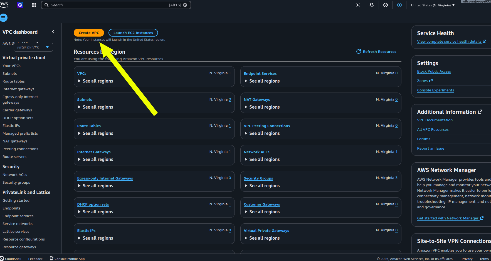

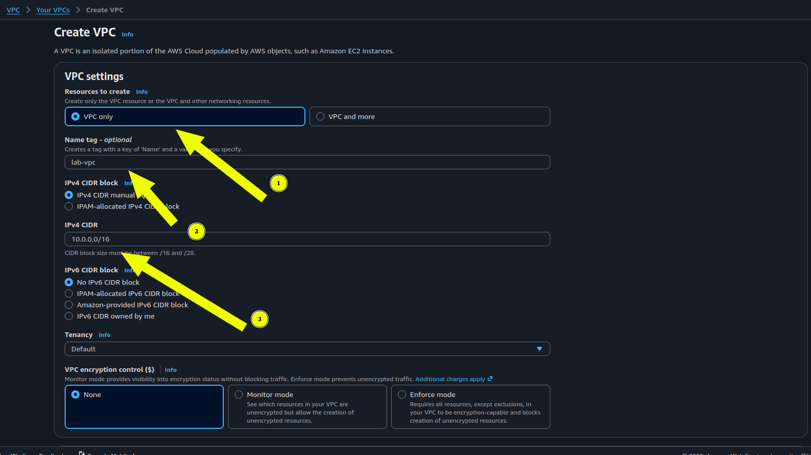

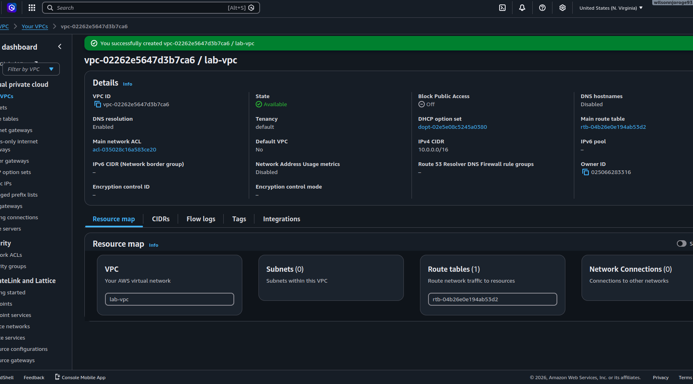

---

## Step 2: Create Two Subnets

**Console path:** `VPC → Subnets → Create subnet → select lab-vpc`

### Public subnet
| Field | Value |
|-------|-------|
| Name | `lab-public-subnet` |
| Availability Zone | `us-east-2a` |
| IPv4 CIDR | `10.0.1.0/24` |

Click **Add new subnet** before saving, then fill in the private one:

### Private subnet
| Field | Value |
|-------|-------|
| Name | `lab-private-subnet` |
| Availability Zone | `us-east-2a` |
| IPv4 CIDR | `10.0.2.0/24` |

> **Why two?** Public subnet = web servers (internet-reachable). Private subnet = databases, app servers (no direct internet). This separation is the foundation of secure cloud architecture. A `/24` gives you 256 addresses: AWS reserves 5, leaving 251 usable.


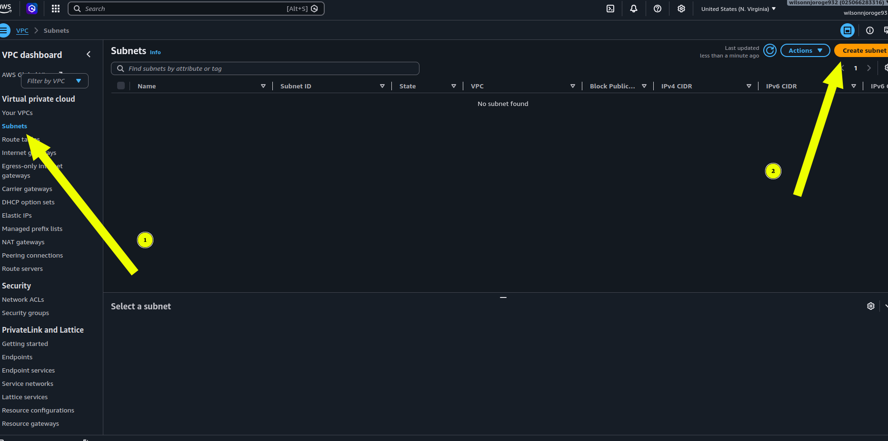

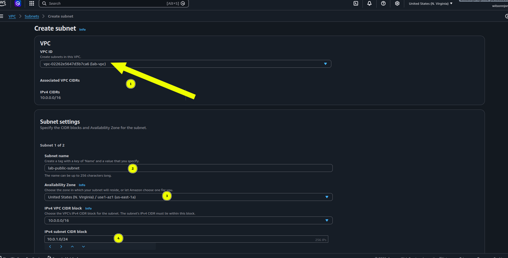

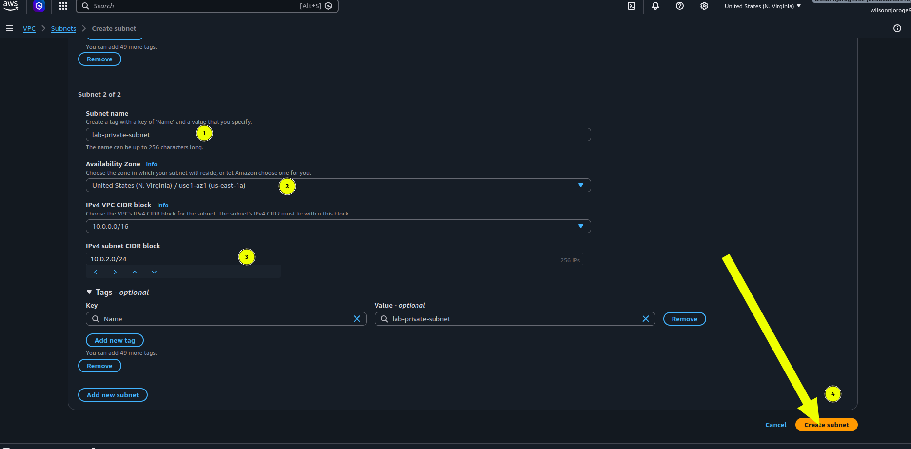
---

## Step 3: Create and Attach an Internet Gateway

**Console path:** `VPC → Internet Gateways → Create internet gateway`

| Field | Value |
|-------|-------|
| Name tag | `lab-igw` |

After creating, status shows **Detached**. You must attach it manually:

```
Actions → Attach to VPC → select lab-vpc → Attach internet gateway
```

> ⚠️ **Common beginner mistake:** Creating the IGW is not enough. If you skip the attach step, nothing in your VPC can reach the internet.


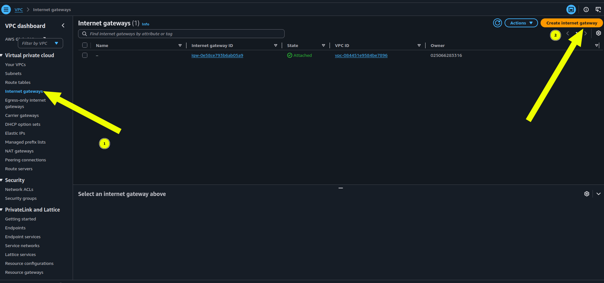

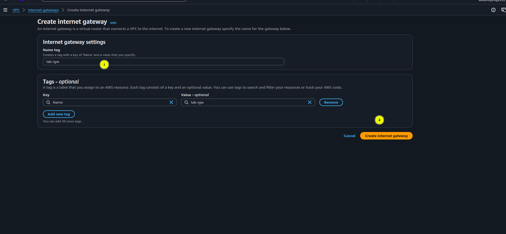

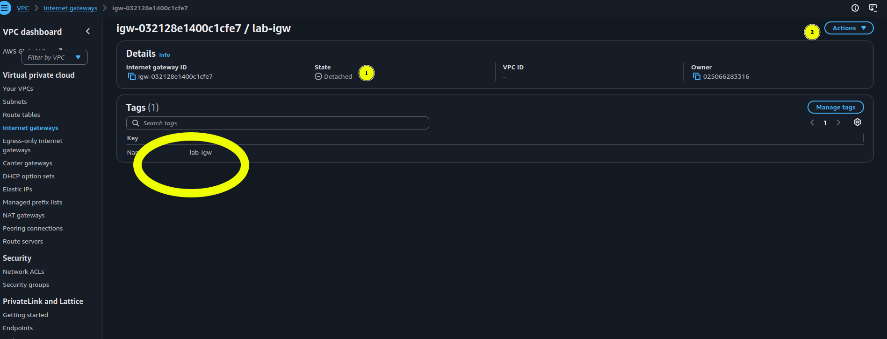

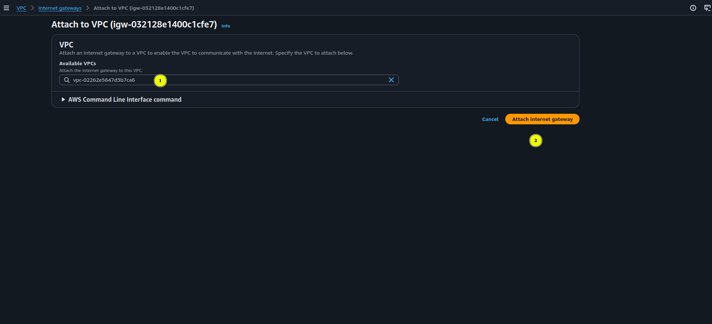

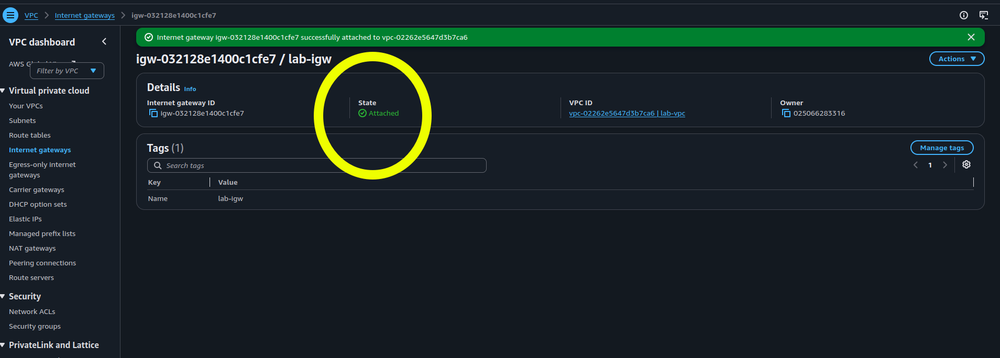

---

## Step 4: Create a Route Table and Add a Route

**Console path:** `VPC → Route Tables → Create route table`

| Field | Value |
|-------|-------|
| Name | `lab-public-rt` |
| VPC | `lab-vpc` |


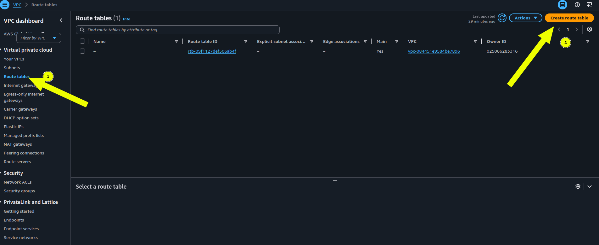

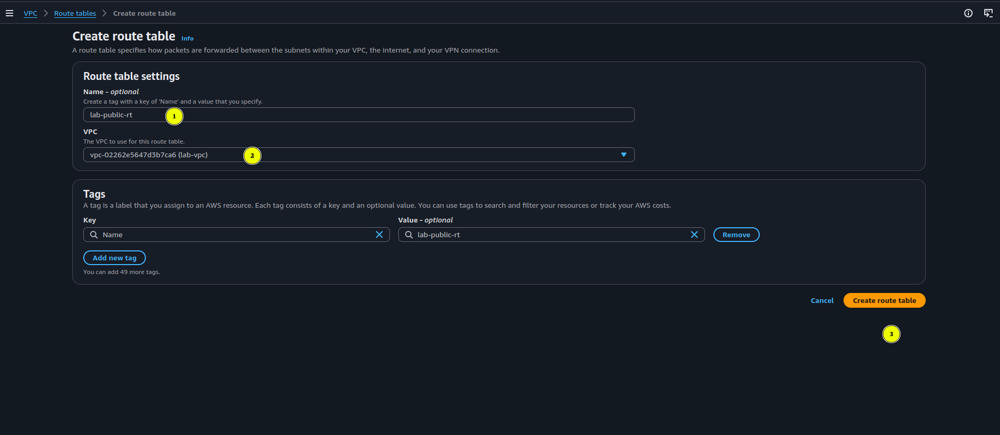

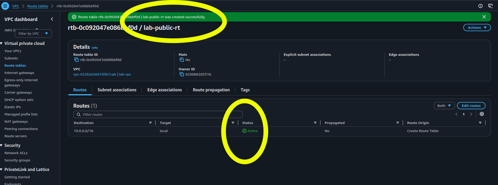


### Add the internet route
1. Click your new route table → **Routes** tab → **Edit routes** → **Add route**

| Destination | Target |
|-------------|--------|
| `0.0.0.0/0` | Internet Gateway → `lab-igw` |

2. Save routes.

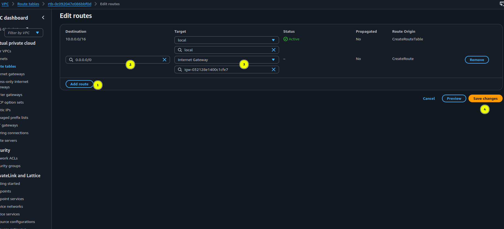


### Associate with the public subnet
`Subnet associations tab → Edit subnet associations → select lab-public-subnet → Save`

> **This is what makes a subnet public.** The private subnet keeps the default route table (local traffic only). It is purely a routing decision: not a physical difference between the two subnets.


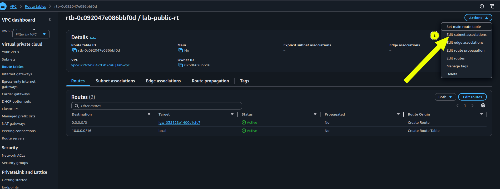


---

## Step 5: Create a Security Group

**Console path:** `EC2 → Security Groups → Create security group`

| Field | Value |
|-------|-------|
| Name | `lab-web-sg` |
| Description | `Allow HTTP and SSH` |
| VPC | `lab-vpc` |

### Inbound rules

| Type | Port | Source | Reason |
|------|------|--------|--------|
| SSH | 22 | **My IP** | Only your machine can connect |
| HTTP | 80 | `0.0.0.0/0` (Anywhere-IPv4) | Web server is publicly accessible |

### Outbound rules
Leave the default: **All traffic** outbound. Your instance needs internet access to download packages.

> **About "My IP":** When you select `My IP`, AWS automatically detects and fills in your current public IP (e.g. `41.80.x.x/32`). The `/32` means exactly one address: yours only. If your IP changes later and SSH stops working, just edit the rule and select `My IP` again.

> **Security concept: stateful firewall:** Security groups are stateful. Allowing inbound SSH automatically permits return traffic. You do not need an explicit outbound rule for established connections. This differs from NACLs, which are stateless (covered in Phase 2).

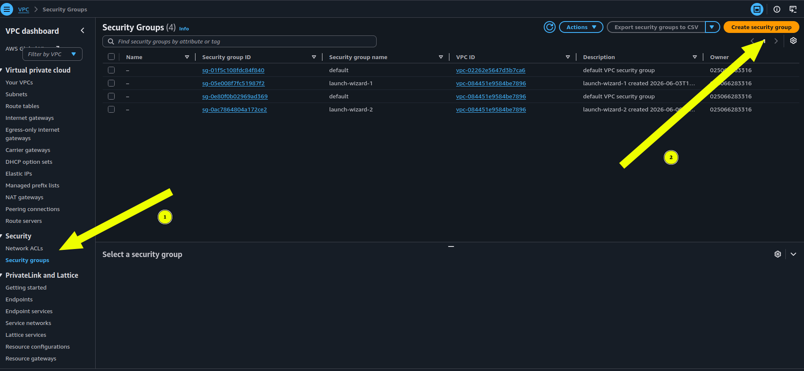

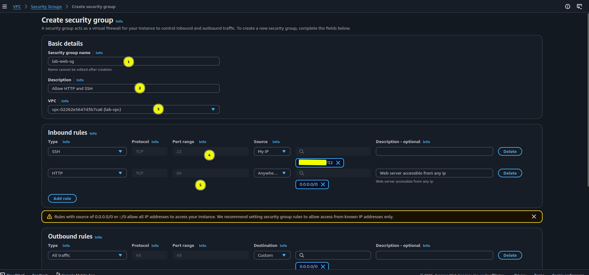

---

## Step 6: Launch an EC2 Instance Into Your VPC

**Console path:** `EC2 → Instances → Launch instance`

| Field | Value |
|-------|-------|
| Name | `lab-web-server` |
| AMI | Amazon Linux 2023 (free tier) |
| Instance type | `t2.micro` |
| Key pair | Create new → `lab-key` → RSA → `.pem` |

> ⚠️ **Download the `.pem` file immediately.** You cannot download it again after creation. Store it somewhere safe.

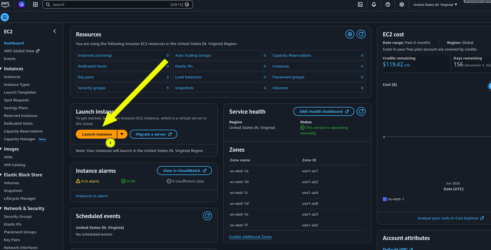

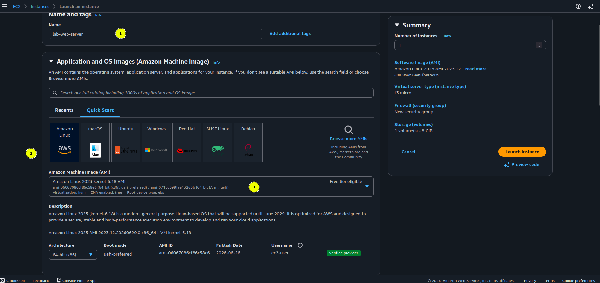

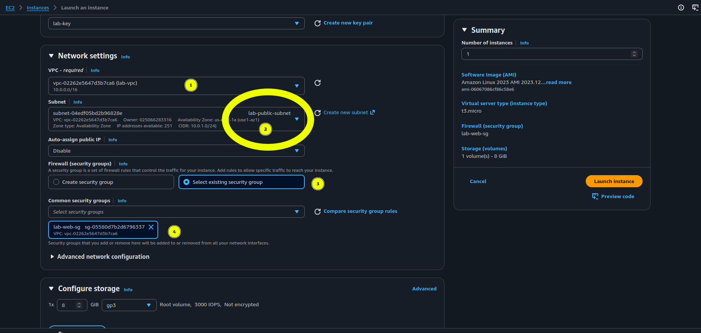

### Network settings → Edit

| Field | Value |
|-------|-------|
| VPC | `lab-vpc` |
| Subnet | `lab-public-subnet` |
| Auto-assign public IP | **Enable** |
| Security group | Select existing → `lab-web-sg` |

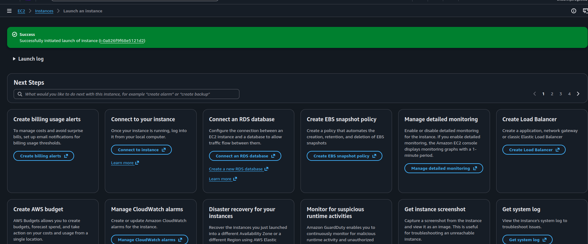

### Advanced details → User data

Paste this script exactly: it runs once on first boot:

```bash
#!/bin/bash
yum update -y
yum install -y httpd
systemctl start httpd
systemctl enable httpd
echo "<h1>My VPC Lab: $(hostname)</h1>" > /var/www/html/index.html
```

Click **Launch instance**. Wait ~2 minutes for status checks to show **2/2 passed**.

---

## Step 7: Verify Everything Works

### Test the web server
1. EC2 → Instances → click `lab-web-server` → copy **Public IPv4 address**
2. Paste it into a browser

**Expected result:** `My VPC Lab: ip-10-0-1-xxx`

If it loads, the full chain worked:
```
Internet → IGW → Route table → Subnet → Security group → EC2 → Apache
```

### Test SSH access

```bash
chmod 400 lab-key.pem
ssh -i lab-key.pem ec2-user@<your-public-ip>
```

**Expected result:** Amazon Linux terminal prompt.

### Troubleshooting

| Symptom | Likely cause | Fix |
|---------|-------------|-----|
| Web page won't load | Port 80 not open | Check security group HTTP rule |
| SSH times out | Your IP changed | Edit SG rule → set source to `My IP` again |
| Instance unreachable | IGW not attached or missing route | Check Step 3 and Step 4 |
| Instance has no public IP | Auto-assign was off | Must re-launch with it enabled |

---

## Step 8: Forensics Challenge 🔍

Do this **before** cleaning up. These are your first cloud forensic artifacts.

### CloudTrail: API call forensics

```
CloudTrail → Event history → filter: Event name = RunInstances
```

You will see the exact timestamp, source IP, IAM user, and all parameters used to launch the instance. This is how you reconstruct *"who launched this and when"* during a real incident investigation.

### VPC Flow Logs: network forensics

```
VPC → Your VPCs → select lab-vpc → Flow logs tab → Create flow log
```

| Field | Value |
|-------|-------|
| Filter | All (captures accepted AND rejected traffic) |
| Destination | CloudWatch Logs |
| Log group | `/vpc/lab-flowlogs` (create new) |

After a few minutes, go to `CloudWatch → Log groups → /vpc/lab-flowlogs`. You will see every network connection: source IP, destination IP, port, protocol, bytes transferred, and whether it was `ACCEPT` or `REJECT`.

> This is the same data a forensic investigator uses after a breach to determine what was accessed, from where, and when.

### Investigate these questions
- Can you find your own SSH connection in the flow logs?
- What does a `REJECT` entry look like versus an `ACCEPT`?
- In CloudTrail, what other events were logged when you built this VPC?

---

## 🧹 Cleanup: Do This When Done

Delete in this exact order: dependencies matter:

```
1. EC2 → Instances → Terminate lab-web-server  (wait for: Terminated)
2. EC2 → Security Groups → Delete lab-web-sg
3. VPC → Internet Gateways → Detach lab-igw → then Delete
4. VPC → Subnets → Delete lab-public-subnet
5. VPC → Subnets → Delete lab-private-subnet
6. VPC → Route Tables → Delete lab-public-rt
7. VPC → Your VPCs → Delete lab-vpc
```

> Estimated total cost if cleaned up within 2 hours: **under $0.10**

---

## Component Summary

| Component | Purpose | Cybersecurity relevance |
|-----------|---------|------------------------|
| VPC | Isolated network boundary | Network segmentation |
| Public subnet | Internet-reachable zone | DMZ equivalent |
| Private subnet | Internal-only zone | Protected internal network |
| Internet gateway | VPC-to-internet bridge | Perimeter control point |
| Route table | Traffic routing rules | Network access control |
| Security group | Instance-level firewall | Host-based firewall |
| CloudTrail | API audit log | Forensic evidence |
| VPC Flow Logs | Network traffic log | Network forensics |

---

## Phase 1 Progress Tracker

- [ ] Understand VPC, subnets, IGW, route tables, security groups
- [ ] Rebuild this lab using the AWS CLI
- [ ] Add a NAT Gateway for private subnet outbound access
- [ ] Create IAM users, groups, roles and policies
- [ ] Enable GuardDuty and Security Hub (Phase 2)

---

## Next Challenge

Once you can build this in the console, repeat the entire exercise using only the **AWS CLI**. That is when concepts truly solidify: and it is how real engineers and incident responders work.

Ask: *"Give me the AWS CLI version of this VPC exercise"*

---

*Phase 1 · AWS Cybersecurity & Digital Forensics Roadmap*
