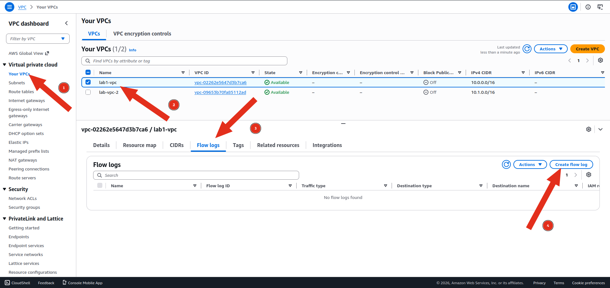
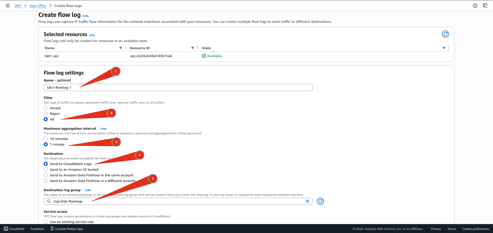
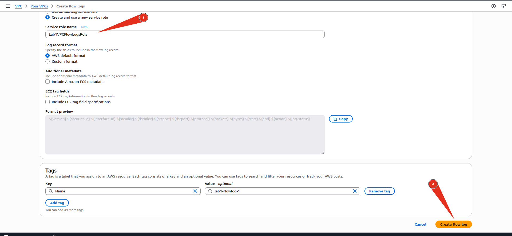
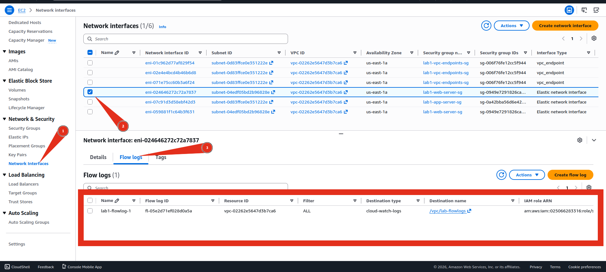

# 🌊 VPC Flow Logs: Network Traffic Analysis

> **Phase 2 · Document 10 of 29**
> **Estimated cost:** ~$1–2/month · **Estimated time:** 60 minutes
> **Prerequisites:** `01-vpc-from-scratch.md`, `06-cloudtrail-setup.md`

---

## What Are VPC Flow Logs?

VPC Flow Logs capture metadata about every network connection in your VPC: who connected to what, on which port, how many bytes, and whether it was accepted or rejected. Think of it as your network's call log.

```
EC2 Instance A ──→ [Flow Log captures this connection] ──→ EC2 Instance B
                          │
                          ▼
              srcIP | dstIP | port | protocol | bytes | action
              10.0.1.10 | 10.0.2.20 | 443 | TCP | 5420 | ACCEPT
```

> **Forensics relevance:** Flow logs are your network forensic evidence. They tell you which IP talked to which, when, and how much data moved: even if the packet contents are encrypted.

---

## What Flow Logs Capture vs Miss

| Captured ✅ | Not captured ❌ |
|------------|----------------|
| Source and destination IP | Packet contents |
| Source and destination port | DNS query names (use Route53 resolver logs) |
| Protocol (TCP/UDP/ICMP) | HTTP request paths |
| Bytes and packets transferred | Application layer data |
| ACCEPT or REJECT decision | Traffic to/from 169.254.169.254 (metadata) |
| Start and end timestamps | DHCP traffic |

---

## Flow Log Record Format

```
version account-id interface-id srcaddr dstaddr srcport dstport protocol packets bytes start end action log-status

2 123456789012 eni-abc123 10.0.1.10 52.94.5.15 54321 443 6 10 4520 1704067200 1704067260 ACCEPT OK
```

| Field | Value | Meaning |
|-------|-------|---------|
| srcaddr | 10.0.1.10 | Source IP (your EC2 instance) |
| dstaddr | 52.94.5.15 | Destination IP (AWS S3 endpoint) |
| srcport | 54321 | Ephemeral source port |
| dstport | 443 | HTTPS: encrypted web traffic |
| protocol | 6 | TCP |
| bytes | 4520 | Data transferred |
| action | ACCEPT | Security group/NACL allowed it |

---

## Step 1: Enable Flow Logs on Your VPC

**Console path:** `VPC → Your VPCs → select lab-vpc → Flow logs tab → Create flow log`



| Field | Value |
|-------|-------|
| Filter | All (captures ACCEPT and REJECT) |
| Maximum aggregation interval | 1 minute |
| Destination | Send to CloudWatch Logs |
| Destination log group | `/vpc/lab-flowlogs` (create new) |
| IAM role | Create new role → `VPCFlowLogsRole` |





Click **Create flow log**.

> **Why "All" and not just "Reject"?** ACCEPT logs show you lateral movement, data exfiltration, and C2 communication. REJECT logs show you scanning and blocked attacks. You need both for a complete picture.

---

## Step 2: Enable Flow Logs on a Specific ENI

For higher resolution on a specific instance (e.g. a suspected compromised host), enable flow logs at the ENI (Elastic Network Interface) level.

```
EC2 → Network interfaces → select the ENI of your instance
→ Flow logs tab → Create flow log
  Destination: CloudWatch Logs
  Log group:   /vpc/eni-specific-logs
```



ENI-level logs give you the same data but scoped to one instance: useful during an incident when you don't want to process your entire VPC's traffic.

---

## Step 3: Query Flow Logs with CloudWatch Logs Insights

**Console path:** `CloudWatch → Logs Insights → select /vpc/lab-flowlogs`

### Query 1: Top talkers (most data sent)

```sql
fields srcaddr, dstaddr, bytes
| filter action = "ACCEPT"
| stats sum(bytes) as totalBytes by srcaddr, dstaddr
| sort totalBytes desc
| limit 20
```

### Query 2: All rejected connections (blocked attacks)

```sql
fields srcaddr, dstaddr, dstport, protocol
| filter action = "REJECT"
| stats count(*) as attempts by srcaddr, dstport
| sort attempts desc
| limit 50
```

> A single source IP attempting hundreds of different destination ports = port scan. This query surfaces it immediately.

### Query 3: Detect port scanning

```sql
fields srcaddr, dstport
| filter action = "REJECT"
| stats count_distinct(dstport) as uniquePorts by srcaddr
| filter uniquePorts > 10
| sort uniquePorts desc
```

> Any source IP probing more than 10 different ports is almost certainly scanning your infrastructure.

### Query 4: Find SSH connections (port 22)

```sql
fields srcaddr, dstaddr, dstport, action, bytes
| filter dstport = 22
| sort @timestamp desc
| limit 50
```

### Query 5: Detect potential data exfiltration

```sql
fields srcaddr, dstaddr, bytes
| filter srcaddr like /^10\.0\./
| filter bytes > 1000000
| stats sum(bytes) as totalBytes by srcaddr, dstaddr
| sort totalBytes desc
| limit 20
```

> This filters for large outbound transfers from internal IPs. Any internal host sending >1MB to an external IP warrants investigation.

### Query 6: Connections to unusual ports

```sql
fields srcaddr, dstaddr, dstport, action
| filter action = "ACCEPT"
| filter dstport not in [80, 443, 22, 3306, 5432, 8080, 8443]
| stats count(*) as connections by dstport, dstaddr
| sort connections desc
| limit 30
```

---

## Step 4: Query Flow Logs with Athena (Scale)

For large environments, Athena queries S3-stored flow logs directly using SQL: faster and cheaper than CloudWatch Logs Insights at scale.

### Send flow logs to S3 instead

```
VPC → Flow logs → Create flow log
  Destination: S3 bucket
  S3 bucket ARN: arn:aws:s3:::lab-flowlogs-yourname/flowlogs/
```

### Create Athena table

```
Athena → Query editor → create database flowlogs_db
```

```sql
CREATE EXTERNAL TABLE IF NOT EXISTS flowlogs_db.vpc_flow_logs (
  version int,
  account string,
  interfaceid string,
  sourceaddress string,
  destinationaddress string,
  sourceport int,
  destinationport int,
  protocol int,
  numpackets int,
  numbytes bigint,
  starttime int,
  endtime int,
  action string,
  logstatus string
)
PARTITIONED BY (dt string)
ROW FORMAT DELIMITED FIELDS TERMINATED BY ' '
LOCATION 's3://lab-flowlogs-yourname/flowlogs/AWSLogs/ACCOUNT-ID/vpcflowlogs/us-east-2/'
TBLPROPERTIES ("skip.header.line.count"="1");
```

Now query it like a database:

```sql
-- Top external IPs communicating with your VPC
SELECT sourceaddress, COUNT(*) as connections, SUM(numbytes) as totalbytes
FROM flowlogs_db.vpc_flow_logs
WHERE action = 'ACCEPT'
  AND sourceaddress NOT LIKE '10.%'
  AND sourceaddress NOT LIKE '172.%'
  AND sourceaddress NOT LIKE '192.168.%'
GROUP BY sourceaddress
ORDER BY totalbytes DESC
LIMIT 20;
```

---

## Step 5: Build a Flow Log Dashboard

**Console path:** `CloudWatch → Dashboards → lab-security-dashboard → Edit`

Add these widgets:

| Widget | Query | Purpose |
|--------|-------|---------|
| Bar chart | REJECT count by srcaddr | Top scanners/attackers |
| Line graph | Total bytes over time | Spot exfiltration spikes |
| Table | SSH connections (dstport=22) | SSH access monitoring |
| Number | Unique source IPs today | Connection volume baseline |

---

## Step 6: Forensics Investigation Using Flow Logs

### Scenario: You received a GuardDuty alert for SSH brute force

**Step 1: Identify the attacker IP from GuardDuty finding**

```
GuardDuty → Findings → UnauthorizedAccess:EC2/SSHBruteForce
Note the sourceIPAddress: 198.51.100.42
```

**Step 2: Query flow logs to scope the attack**

```sql
fields @timestamp, srcaddr, dstaddr, dstport, action, bytes
| filter srcaddr = "198.51.100.42"
| sort @timestamp asc
```

**Step 3: Check if any connection succeeded**

```sql
fields @timestamp, srcaddr, dstport, action, bytes
| filter srcaddr = "198.51.100.42"
| filter action = "ACCEPT"
| filter dstport = 22
```

If you see ACCEPT entries for port 22 → the attacker got in. Escalate to full incident response.

**Step 4: Check what happened after a successful login**

```sql
fields @timestamp, srcaddr, dstaddr, dstport, bytes
| filter srcaddr = "your-ec2-private-ip"
| filter @timestamp > "after-the-successful-ssh-login-time"
| sort bytes desc
```

Large outbound bytes after a successful SSH login = data exfiltration.

---

## Flow Log Interpretation Reference

| Pattern | What it indicates |
|---------|-----------------|
| Single IP → many ports, REJECT | Port scanning |
| Many IPs → port 22, REJECT | SSH brute force distributed attack |
| Internal IP → external, large bytes | Data exfiltration candidate |
| Internal IP → unusual port | Possible C2 communication or lateral movement |
| External IP → port 3389 | RDP brute force attempt |
| Internal → internal, new connection pattern | Lateral movement |
| Repeated REJECT from same src/dst pair | Blocked connection attempt: monitor |

---

## Common CLI Commands

```bash
# Describe flow logs on a VPC
aws ec2 describe-flow-logs \
  --filter "Name=resource-id,Values=vpc-xxxxxxxx"

# Create flow log via CLI
aws ec2 create-flow-logs \
  --resource-type VPC \
  --resource-ids vpc-xxxxxxxx \
  --traffic-type ALL \
  --log-destination-type cloud-watch-logs \
  --log-group-name /vpc/lab-flowlogs \
  --deliver-logs-permission-arn arn:aws:iam::ACCOUNT:role/VPCFlowLogsRole
```

---

## Cleanup

```
# Flow logs themselves are free to enable
# Cost comes from CloudWatch Logs storage

# Reduce log group retention:
CloudWatch → Log groups → /vpc/lab-flowlogs → Actions → Edit retention → 7 days

# Delete the flow log configuration if done:
VPC → Flow logs → select → Actions → Delete flow logs
```

---

## Phase 2 Progress Tracker

- [x] GuardDuty setup and findings
- [x] VPC Flow Logs and analysis
- [ ] AWS Config and drift detection
- [ ] Security Hub overview
- [ ] WAF setup
- [ ] KMS encryption basics
- [ ] Secrets Manager

---

*Phase 2 · AWS Cybersecurity & Digital Forensics Roadmap*