# 🔑 KMS: Key Management & Encryption

> **Phase 2 · Document 14 of 29**
> **Estimated cost:** ~$1/month per key · **Estimated time:** 45–60 minutes
> **Prerequisites:** `02-iam-users-groups-roles.md`, `04-s3-buckets-and-policies.md`

---

## What Is KMS?

AWS Key Management Service (KMS) creates and manages cryptographic keys used to encrypt your data. It handles the hard parts of key management: generation, storage, rotation, and access control: so you never have to store raw keys in code or config files.

```
Your data (plaintext)
      │
      ▼
KMS encrypts with your key
      │
      ▼
Encrypted ciphertext stored in S3 / EBS / RDS / etc.

To read the data:
  → Request must pass KMS key policy check
  → IAM identity must have kms:Decrypt permission
  → KMS decrypts and returns plaintext
```

> **Forensics relevance:** KMS keys control access to encrypted evidence. Understanding who has `kms:Decrypt` access, and auditing key usage in CloudTrail, is essential for both protecting evidence and investigating breaches of encrypted data.

---

## Encryption Types in AWS

| Type | What it means | Who manages the key |
|------|--------------|-------------------|
| **SSE-S3** | AWS encrypts with S3-managed keys | AWS (you have no control) |
| **SSE-KMS** | AWS encrypts with your KMS key | You (via KMS key policy) |
| **SSE-C** | You provide the key per request | You (key never stored in AWS) |
| **Client-side** | You encrypt before sending to AWS | You (entirely your responsibility) |

> For forensics and security work, always use **SSE-KMS**. It gives you control over who can decrypt, full audit logs of every decryption, and the ability to revoke access instantly by disabling the key.

---

## Step 1: Create a Customer Managed Key (CMK)

**Console path:** `KMS → Customer managed keys → Create key`

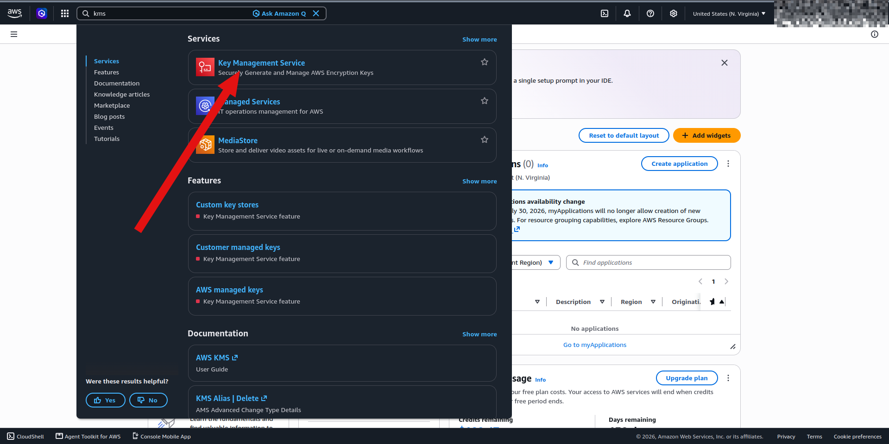

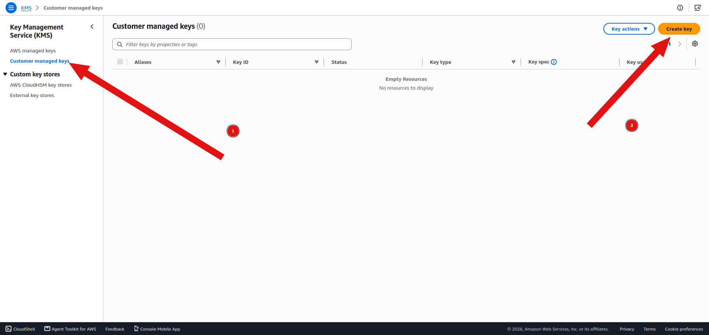

### Key configuration

| Field | Value |
|-------|-------|
| Key type | Symmetric |
| Key usage | Encrypt and decrypt |
| Key material origin | KMS (AWS generates the key material) |

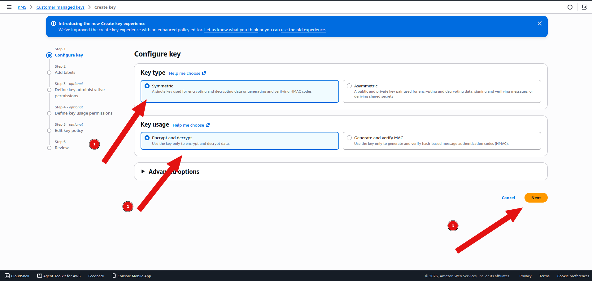

### Labels

| Field | Value |
|-------|-------|
| Alias | `lab1-main-key` |
| Description | `Main encryption key for lab resources` |
| Tags | Environment=Lab |

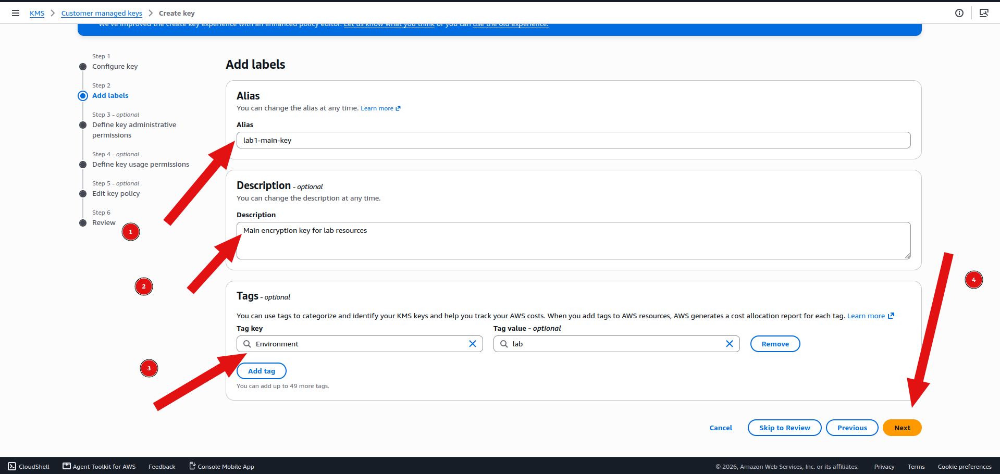

### Key administrators

Select your admin IAM user. Administrators can manage the key (delete, disable, rotate) but this does not grant them automatic decrypt access.

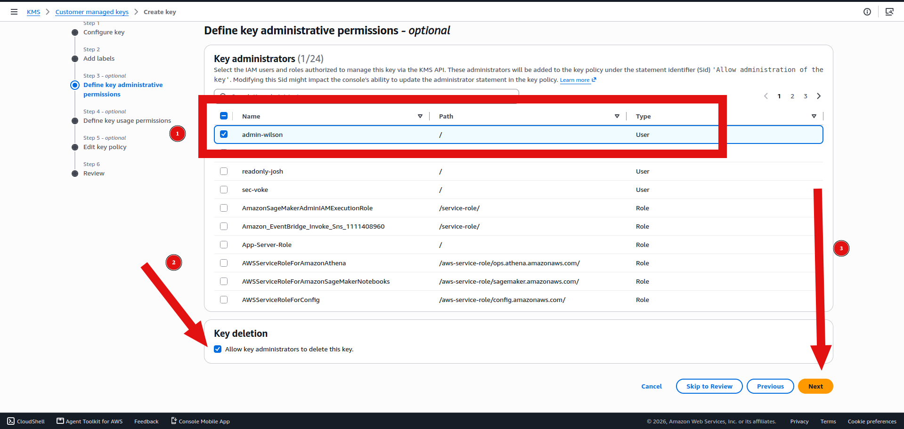

### Key usage permissions

Select the IAM users and roles that can use this key for encryption/decryption:
- Your admin user
- `lab-ec2-s3-read-role` (so EC2 can decrypt S3 objects)

Click **Finish**.

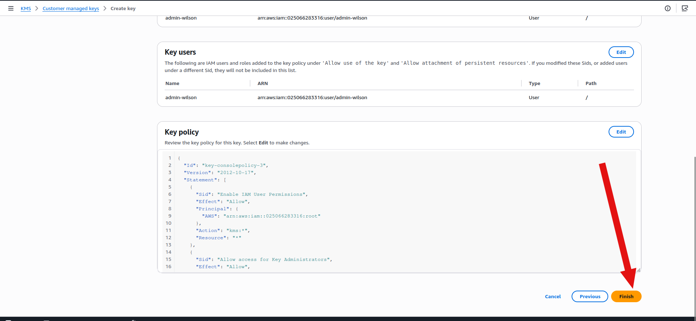

> **Key policy vs IAM policy:** KMS uses both. The key policy on the KMS key must allow the identity. The IAM policy on the identity must allow `kms:*` actions. Both must allow: either one denying is enough to block access.

---

## Step 2: Understand the Key Policy

View the auto-generated key policy:

```
KMS → lab1-main-key → Key policy tab
```

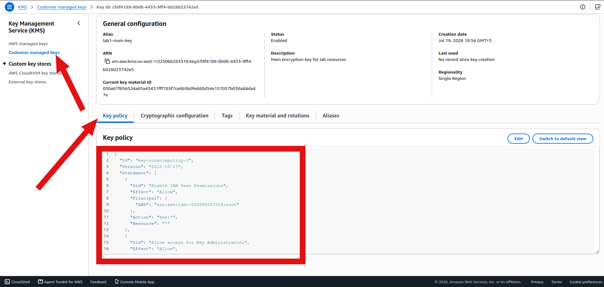

```json
{
  "Version": "2012-10-17",
  "Statement": [
    {
      "Sid": "Enable IAM User Permissions",
      "Effect": "Allow",
      "Principal": {
        "AWS": "arn:aws:iam::ACCOUNT-ID:root"
      },
      "Action": "kms:*",
      "Resource": "*"
    },
    {
      "Sid": "Allow key administrators",
      "Effect": "Allow",
      "Principal": {
        "AWS": "arn:aws:iam::ACCOUNT-ID:user/admin-yourname"
      },
      "Action": [
        "kms:Create*", "kms:Describe*", "kms:Enable*",
        "kms:List*", "kms:Put*", "kms:Update*",
        "kms:Revoke*", "kms:Disable*", "kms:Get*",
        "kms:Delete*", "kms:ScheduleKeyDeletion", "kms:CancelKeyDeletion"
      ],
      "Resource": "*"
    },
    {
      "Sid": "Allow key usage",
      "Effect": "Allow",
      "Principal": {
        "AWS": "arn:aws:iam::ACCOUNT-ID:user/dev-alice"
      },
      "Action": [
        "kms:Encrypt", "kms:Decrypt",
        "kms:ReEncrypt*", "kms:GenerateDataKey*",
        "kms:DescribeKey"
      ],
      "Resource": "*"
    }
  ]
}
```

---

## Step 3: Encrypt an S3 Bucket with Your KMS Key

```
S3 → lab-private-yourname → Properties → Default encryption → Edit
  Encryption type: SSE-KMS
  AWS KMS key:     lab1-main-key
```

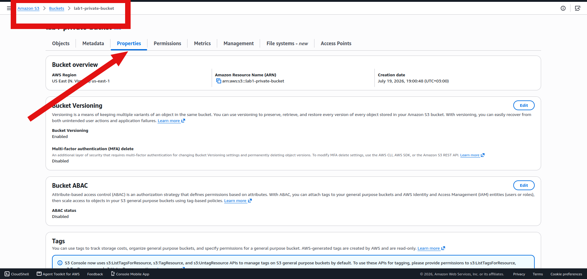

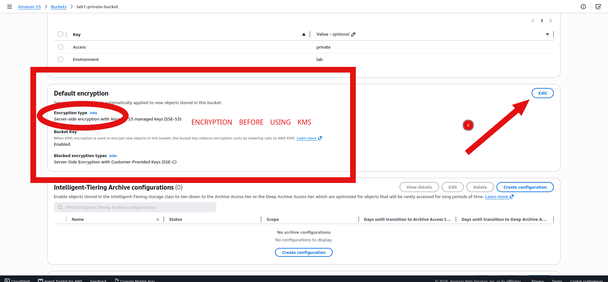

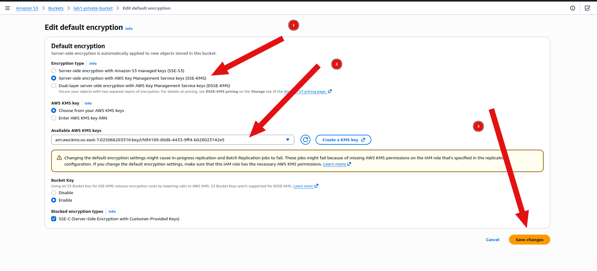

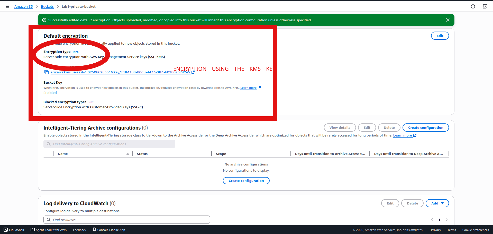

Now all objects uploaded to this bucket are automatically encrypted with your KMS key. Only identities with both the KMS key policy permission and the IAM `kms:Decrypt` permission can read the data.

Test it:

```bash
# Upload a file: automatically encrypted with lab1-main-key
aws s3 cp myfile.txt s3://lab1-private-bucket/

# Download as admin user: should succeed

aws sts get-caller-identity # To check you are admin
aws s3 cp s3://lab1-private-bucket/myfile.txt ./downloaded.txt

# Try downloading as readonly-josh (who has no KMS decrypt permission)
# Log in as josh and run:
aws sts get-caller-identity  # To confirm you are dev-willy (developer)
aws s3 cp s3://lab1-private-bucket/myfile.txt ./test.txt
# Expected: Access Denied
```

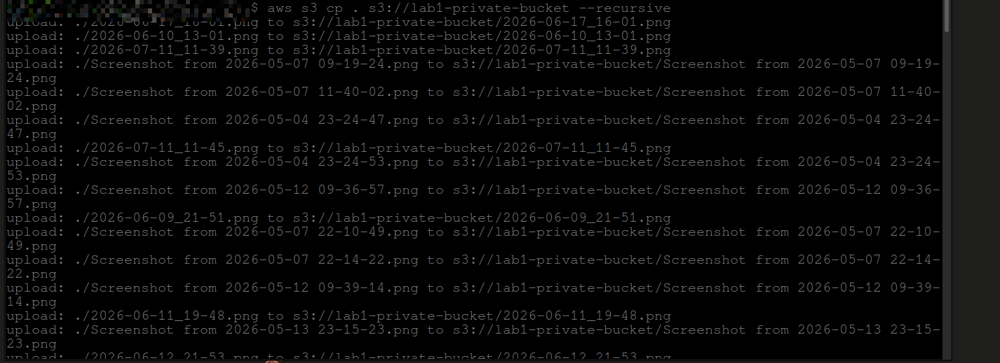

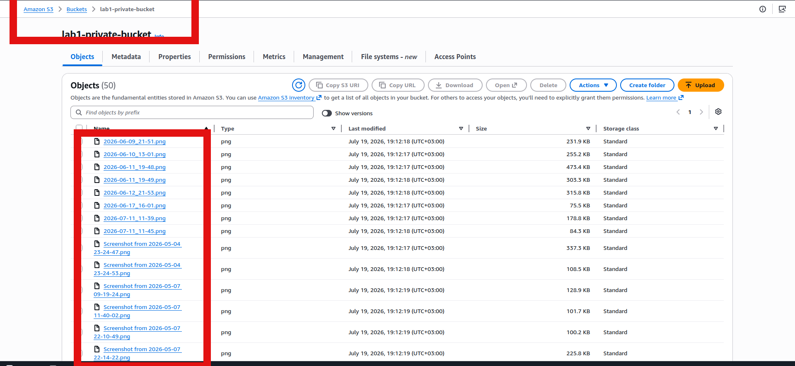

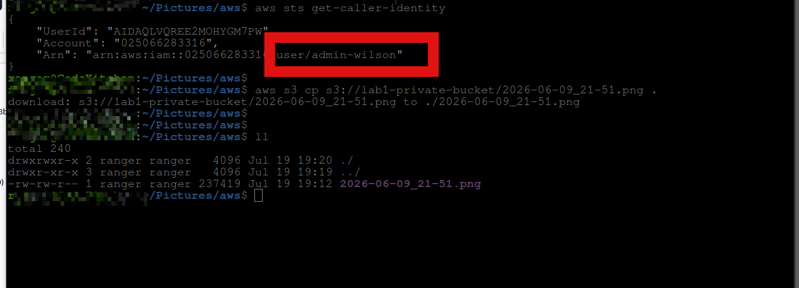

---

## Step 4: Encrypt an EBS Volume

```
EC2 → Volumes → Create volume
  Type:       gp3
  Size:       10 GiB
  AZ:         us-east-2a
  Encryption: Enable
  KMS key:    lab1-main-key
```

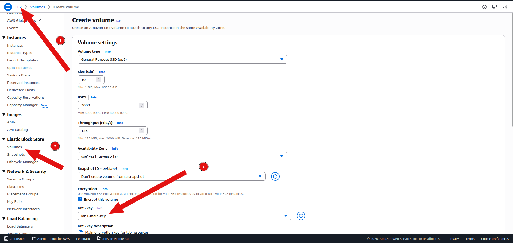

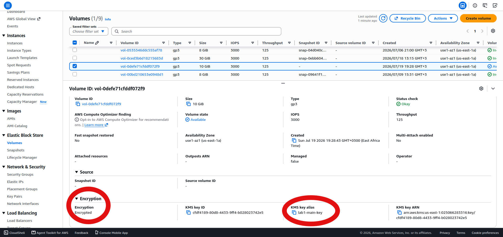

Any snapshots created from this volume are also encrypted. Any volumes created from those snapshots inherit the encryption.

> **Forensics critical:** When you take a forensic EBS snapshot of a KMS-encrypted volume, the snapshot is also encrypted. To analyze it on a forensic workstation outside AWS, you must first create a volume from the snapshot and mount it inside AWS (on a forensic EC2 instance). You cannot simply download an encrypted snapshot and analyze it locally.

---

## Step 5: Encrypt EBS Root Volume of an Existing Instance

To encrypt an existing unencrypted instance:

```
1. Stop the instance
2. Create a snapshot of the root volume
3. Copy the snapshot with encryption enabled:
   EC2 → Snapshots → select snapshot → Actions → Copy snapshot
     Encryption: Enable
     KMS key: lab1-main-key
4. Create a volume from the encrypted snapshot
5. Detach the original root volume
6. Attach the new encrypted volume as /dev/xvda
7. Start the instance
```

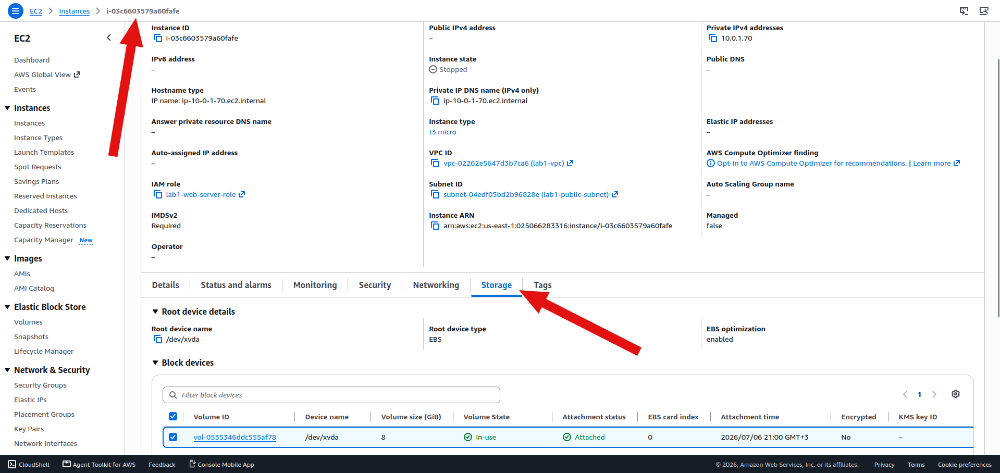

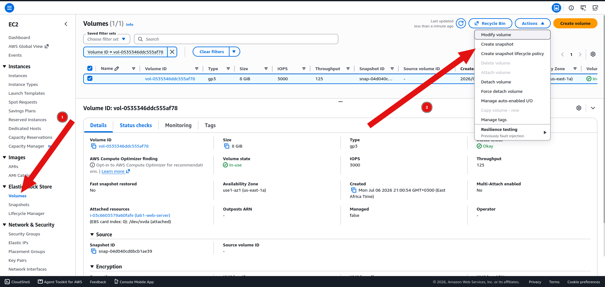

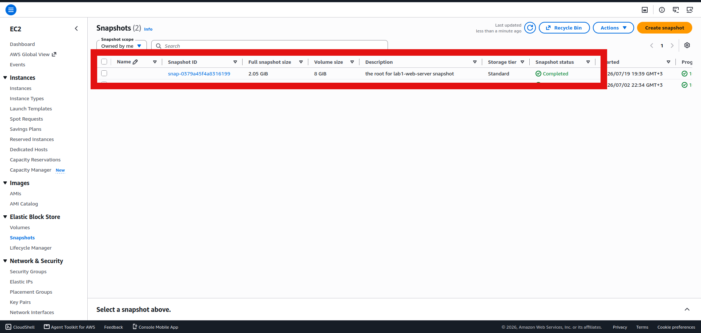

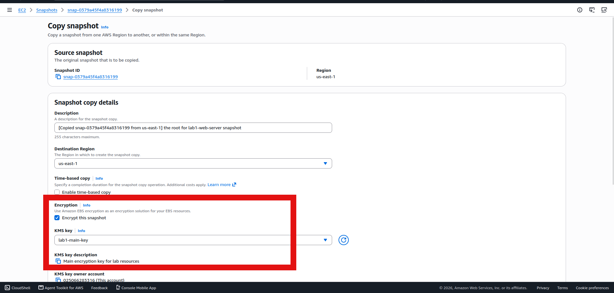

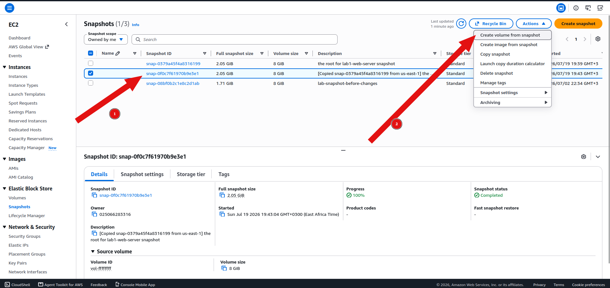

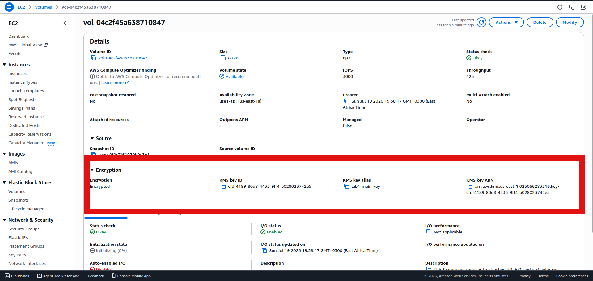

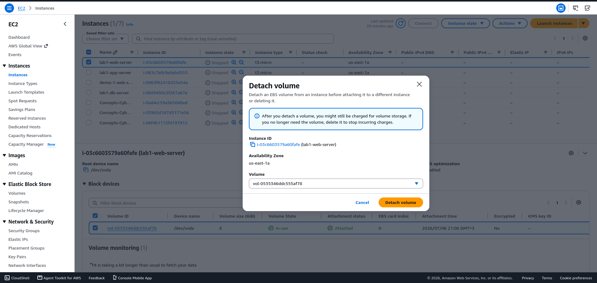

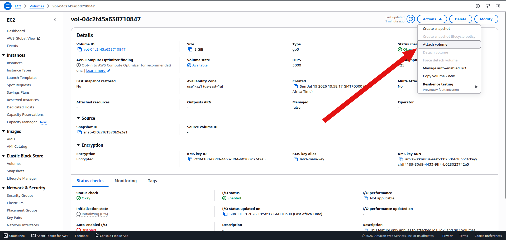

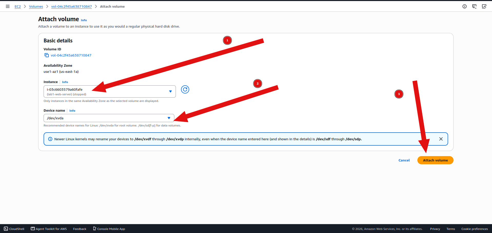

---

## Step 6: Key Rotation

Automatic key rotation generates new key material every year while keeping the same key ID and alias. Old key material is retained to decrypt data encrypted with it.

```
KMS → lab1-main-key → Key rotation tab
  Automatically rotate this KMS key every year: Enable
```

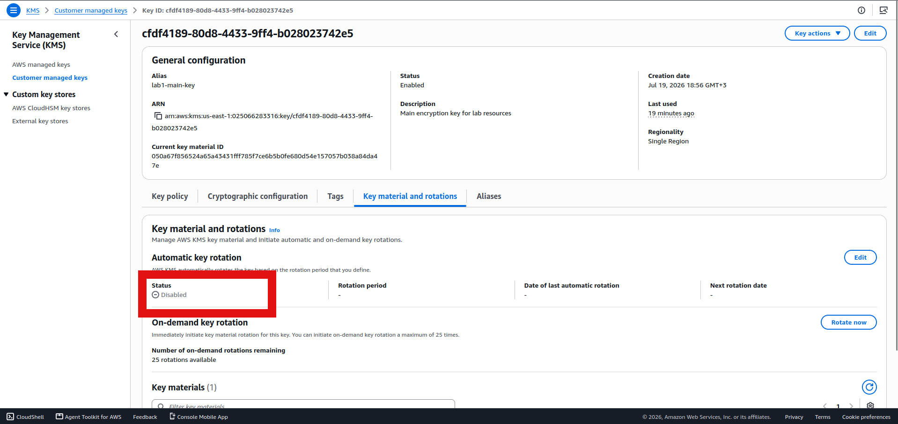

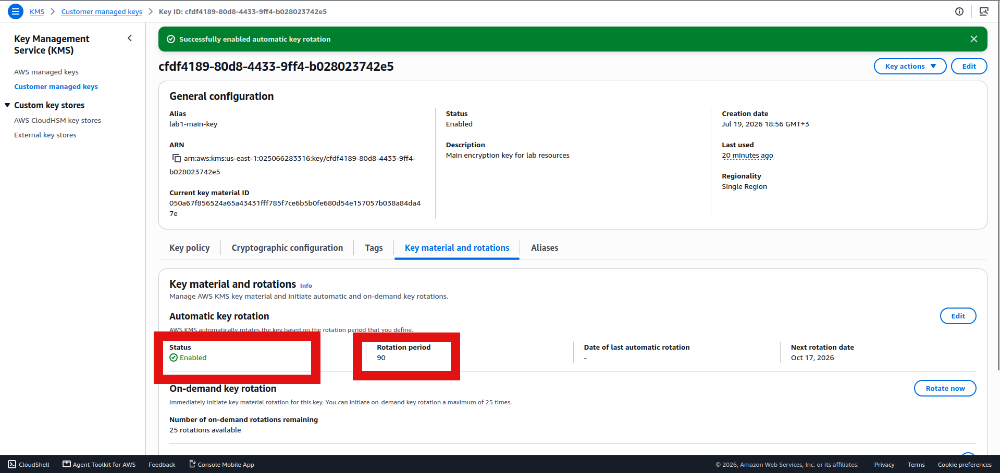

> **Why rotate?** If key material is somehow compromised, rotation limits the window of exposure. Data encrypted with the old material can still be decrypted (AWS retains it internally), but new data uses the new material.

Manual rotation (for stricter compliance):

```bash
# Create a new key
aws kms create-key --description "lab1-main-key-v2"

# Update the alias to point to the new key
aws kms update-alias \
  --alias-name alias/lab1-main-key \
  --target-key-id <new-key-id>
```

---

## Step 7: Audit Key Usage in CloudTrail

Every KMS operation is logged in CloudTrail. This is your encryption audit trail.

```
CloudTrail → Event history → filter: Event source = kms.amazonaws.com
```

Key events to monitor:

| Event | What it means | Security relevance |
|-------|-------------|-------------------|
| `Decrypt` | Someone decrypted data | Who is reading your data? |
| `GenerateDataKey` | Service generated a data key | Normal S3/EBS encryption activity |
| `DisableKey` | Key was disabled | Was this authorized? |
| `ScheduleKeyDeletion` | Key deletion scheduled | CRITICAL: investigate immediately |
| `PutKeyPolicy` | Key policy changed | May indicate privilege escalation |

### CloudWatch alarm for key deletion

```
CloudWatch → Alarms → Create alarm
Metric filter pattern:
{ ($.eventSource = "kms.amazonaws.com") &&
  (($.eventName = "DisableKey") ||
   ($.eventName = "ScheduleKeyDeletion")) }
```

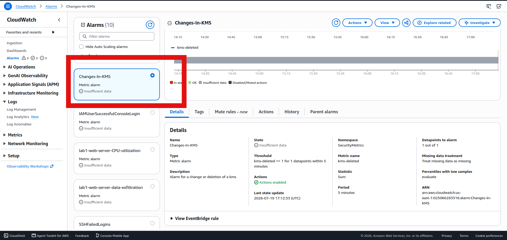

Alert immediately. A disabled or deleted KMS key can make all encrypted data permanently unreadable: this is a catastrophic incident.

---

## Step 8: Key Grants (Temporary Access)

Grants allow temporary, scoped KMS access without modifying the key policy: useful for giving a process decrypt access for a limited time.

```bash
# Create a grant allowing a role to decrypt for 1 hour
aws kms create-grant \
  --key-id alias/lab1-main-key \
  --grantee-principal arn:aws:iam::ACCOUNT-ID:role/lab-ec2-s3-read-role \
  --operations Decrypt GenerateDataKey \
  --name "temp-access-grant"

# Revoke the grant when done
aws kms retire-grant \
  --key-id alias/lab1-main-key \
  --grant-id <grant-id>
```

---

## Forensics Scenario: Ransomware via KMS

A sophisticated cloud attacker can simulate ransomware by:

1. Creating a new KMS key they control
2. Re-encrypting all your S3 objects with their key
3. Deleting your KMS key (or scheduling deletion)
4. Demanding payment for their key

**Detection:**
- CloudTrail: `ReEncrypt` events on S3 objects
- CloudTrail: `ScheduleKeyDeletion` on your key
- Config: S3 bucket encryption settings changed

**Response:**
- Cancel key deletion immediately: `kms:CancelKeyDeletion`
- Identify the IAM identity that made the changes
- Disable that identity
- Restore from S3 versioned backups (if versioning was enabled)

> This scenario underscores why KMS key policy monitoring, S3 versioning, and CloudTrail alerting are all essential: and why they are all covered in this roadmap.

---

## Common CLI Commands

```bash
# List all KMS keys
aws kms list-keys

# List key aliases
aws kms list-aliases

# Describe a key
aws kms describe-key --key-id alias/lab1-main-key

# Encrypt data directly with KMS (for small data <4KB)
aws kms encrypt \
  --key-id alias/lab1-main-key \
  --plaintext "my secret data" \
  --query CiphertextBlob \
  --output text | base64 --decode > encrypted.bin

# Decrypt
aws kms decrypt \
  --ciphertext-blob fileb://encrypted.bin \
  --query Plaintext \
  --output text | base64 --decode

# Disable a key (emergency response)
aws kms disable-key --key-id <key-id>
```

---

## Cleanup

```
# KMS keys cost $1/month each
# You cannot delete a key immediately: minimum 7 day waiting period

KMS → lab1-main-key → Key actions → Schedule key deletion
  Waiting period: 7 days (minimum)

# During the waiting period, the key is disabled but not yet deleted
# Cancel deletion if you change your mind within 7 days
```

---

## Phase 2 Progress Tracker

- [x] GuardDuty setup and findings
- [x] VPC Flow Logs and analysis
- [x] AWS Config and drift detection
- [x] Security Hub overview
- [x] WAF setup
- [x] KMS encryption basics
- [ ] Secrets Manager

---

*Phase 2 · AWS Cybersecurity & Digital Forensics Roadmap*