# 💻 EC2  Instance Lifecycle & Management

> **Phase 1 · Document 3 of 29**  
> **Estimated cost:** ~$0.20 · **Estimated time:** 60–90 minutes  
> **Prerequisites:** `01-vpc-from-scratch.md`, `02-iam-users-groups-roles.md`

---

## What Is EC2?

EC2 (Elastic Compute Cloud) is AWS's virtual machine service. Every time you need a server; web server, forensic workstation, honeypot, attack box; you launch an EC2 instance.

```
AMI (template) + Instance type (hardware) + Network (VPC/subnet) + Storage (EBS) = EC2 Instance
```

> **Forensics relevance:** EC2 instances are the primary target in cloud attacks and the primary source of forensic evidence — disk images, memory, logs, network traffic all originate here.

---

## EC2 Key Concepts

| Concept | What it is |
|---------|-----------|
| **AMI** | Amazon Machine Image — the OS template used to launch an instance |
| **Instance type** | The hardware spec (CPU, RAM, network) |
| **EBS volume** | The virtual hard disk attached to the instance |
| **Key pair** | SSH public/private key for remote access |
| **Elastic IP** | A static public IP that persists across stop/start cycles |
| **Instance metadata** | Data about the instance accessible from within it at `169.254.169.254` |
| **User data** | A script that runs once on first boot |

---

## Instance States

```
Pending → Running → Stopping → Stopped → Starting → Running
                      ↓
                  Shutting down → Terminated (permanent, irreversible)
```

| State | Billed? | Notes |
|-------|---------|-------|
| Pending | No | Instance is starting |
| Running | Yes | Normal operating state |
| Stopped | No (compute) | EBS storage still billed |
| Terminated | No | Instance and data gone permanently |

---

## Step 1 — Launch an EC2 Instance (Full Manual Method)

**Console path:** `EC2 → Instances → Launch instance`

### Name and tags
| Field | Value |
|-------|-------|
| Name | `lab-ec2-main` |

Add a tag: `Key = Environment` · `Value = Lab`

> Tags are critical in real environments. They are used for cost allocation, access control via IAM conditions, and filtering resources during incident response.

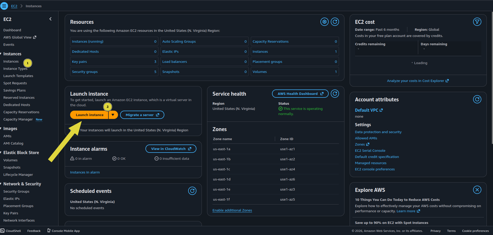


### AMI selection
Choose **Amazon Linux 2023** (free tier eligible).

> For your cybersecurity path you will also work with Ubuntu (penetration testing tools) and Windows Server (Active Directory labs). For now, Amazon Linux 2023 is the standard.

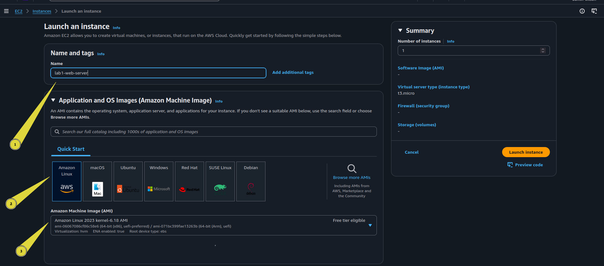


### Instance type
Select `t2.micro` — 1 vCPU, 1 GiB RAM, free tier eligible.

```
Instance type families (memorize these):
  t  → general purpose burstable     (t2, t3) — dev and test
  m  → general purpose balanced      (m5, m6) — production workloads
  c  → compute optimized             (c5, c6) — high CPU tasks
  r  → memory optimized              (r5, r6) — databases, analytics
  i  → storage optimized             (i3, i4) — high IOPS workloads
```

### Key pair
Select your existing `lab-key` or create a new one.

```bash
# If creating new, download the .pem and set permissions immediately:
chmod 400 lab-key.pem
```

### Network settings
| Field | Value |
|-------|-------|
| VPC | `lab-vpc` |
| Subnet | `lab-public-subnet` |
| Auto-assign public IP | Enable |
| Security group | `lab-web-sg` |

### Storage
Leave default: **8 GiB gp3 EBS volume**.

> `gp3` is the current generation general-purpose SSD. Always prefer `gp3` over `gp2` — same performance, lower cost.

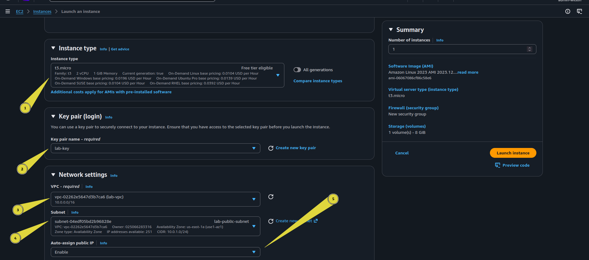

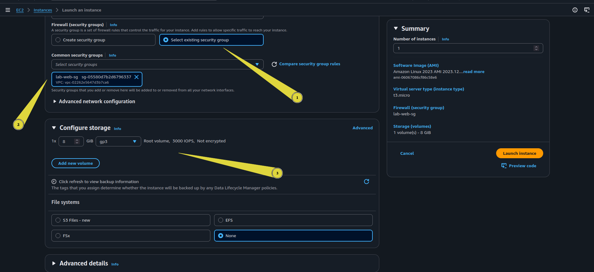

### User data (Advanced details)

```bash
#!/bin/bash
sudo yum update -y
sudo yum install -y httpd wget curl net-tools
sudo systemctl start httpd
sudo systemctl enable httpd
sudo bash -c 'echo "<h1>EC2 Lab — $(hostname -f)</h1>" > /var/www/html/index.html'
```

Click **Launch instance**.

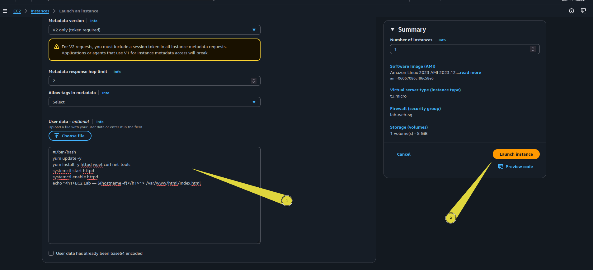

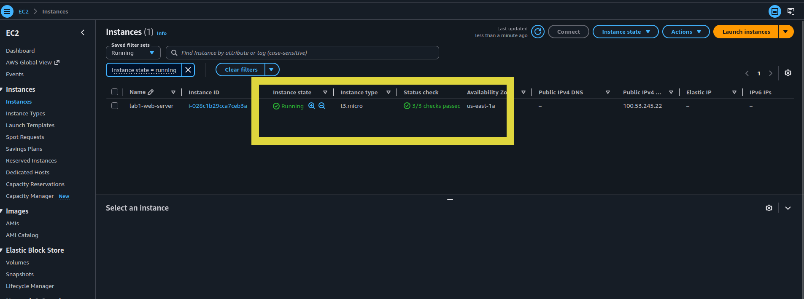


---

## Step 2 — Connect to Your Instance

### Method 1 — SSH from terminal

```bash
ssh -i lab-key.pem ec2-user@<public-ip>
```


### Method 2 — EC2 Instance Connect (browser-based)

```
EC2 → Instances → select instance → Connect → EC2 Instance Connect → Connect
```

No key needed. Works directly in the browser.

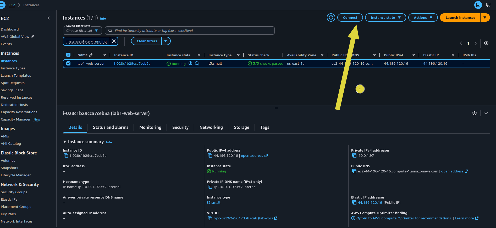

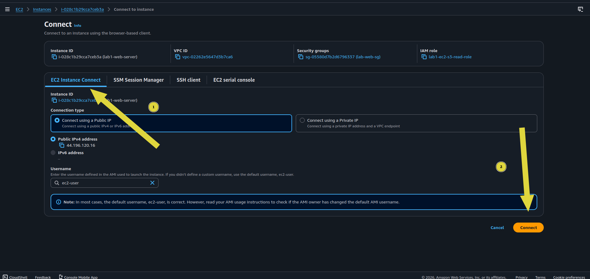

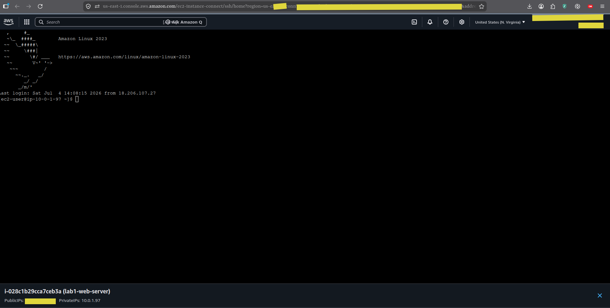


### Method 3 — AWS Systems Manager Session Manager

```
EC2 → Instances → select instance → Connect → Session Manager → Connect
```

No open port 22 required. No key pair needed. All session activity is logged to CloudTrail — the most secure and auditable connection method.

> **Forensics note:** Session Manager logs every command typed during a session. This is evidence-grade logging — if an attacker uses Session Manager, every command they ran is recorded.

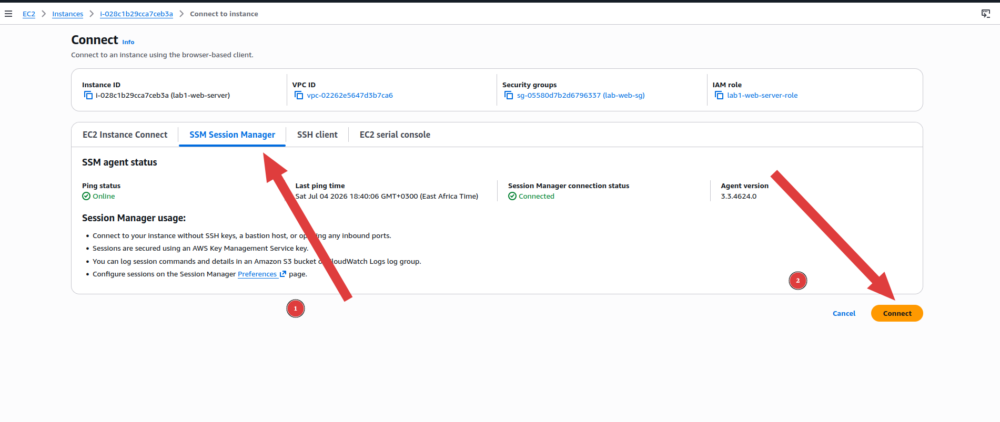

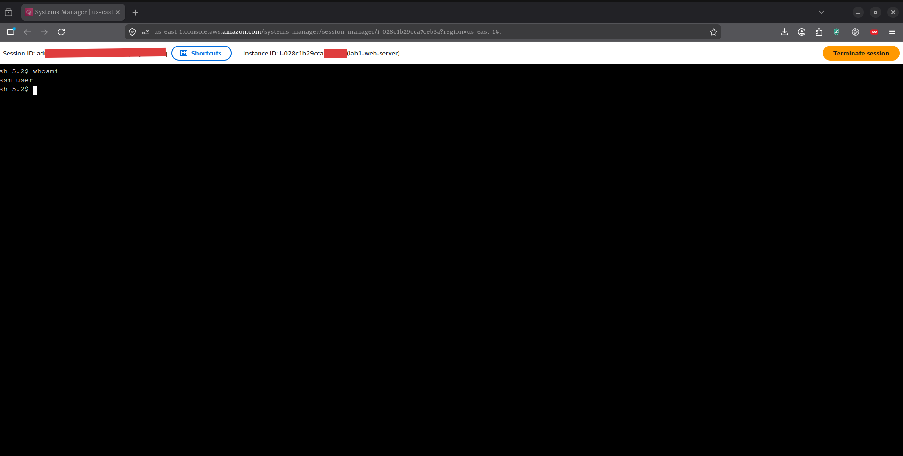

---

## Step 3 — Explore Instance Metadata

From inside your instance, run:

```bash
# Get your instance ID
curl http://169.254.169.254/latest/meta-data/instance-id

# Get your public IP
curl http://169.254.169.254/latest/meta-data/public-ipv4

# Get your IAM role credentials (if a role is attached)
curl http://169.254.169.254/latest/meta-data/iam/security-credentials/
```

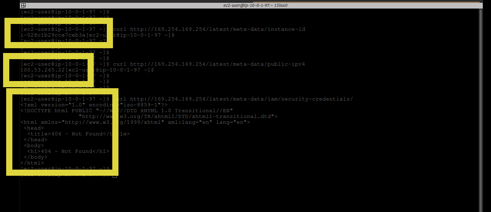


> ⚠️ **Security critical:** The metadata endpoint at `169.254.169.254` is a major attack vector. If an attacker can make your instance send a request to this URL (via SSRF), they can steal IAM credentials. This is covered in depth in `24-imds-attack-and-hardening.md`. For now, enforce IMDSv2:

```
EC2 → Instances → select instance → Actions → Instance settings
→ Modify instance metadata options
→ IMDSv2: Required
```

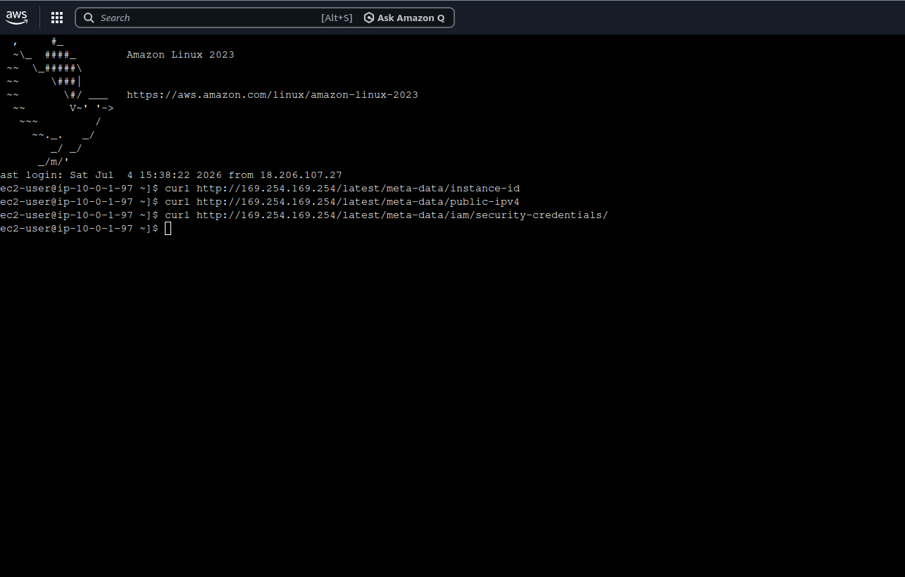

---

## Step 4 — Manage Storage (EBS)

### Add a second EBS volume

```
EC2 → Volumes → Create volume
  Type:              gp3
  Size:              10 GiB
  Availability Zone: us-east-2a   ← must match your instance's AZ
```

After creating:

```
Select the new volume → Actions → Attach volume
→ select lab-ec2-main → device name /dev/sdf
```

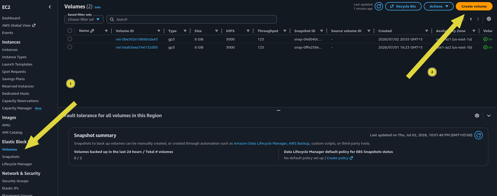


### Mount the volume from inside the instance

```bash
# Check the volume is attached
lsblk

# Format it (only do this once — formatting erases data)
sudo mkfs.ext4 /dev/nvme1n1

# Create a mount point
sudo mkdir /data

# Mount it
sudo mount /dev/nvme1n1 /data

# Verify
df -h
```

> **Forensics relevance:** In cloud forensics you acquire EBS snapshots (covered in `16-ebs-snapshot-forensics.md`) instead of pulling physical drives. Understanding how volumes attach and mount is the foundation of that process.

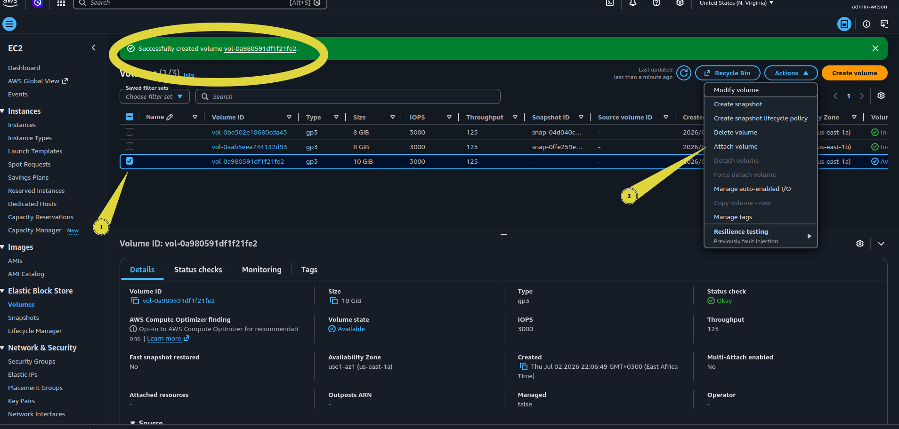

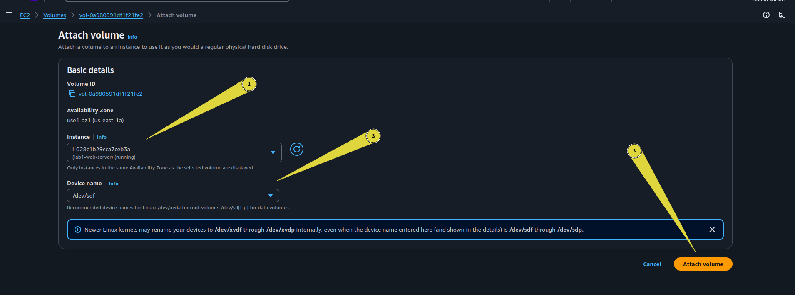

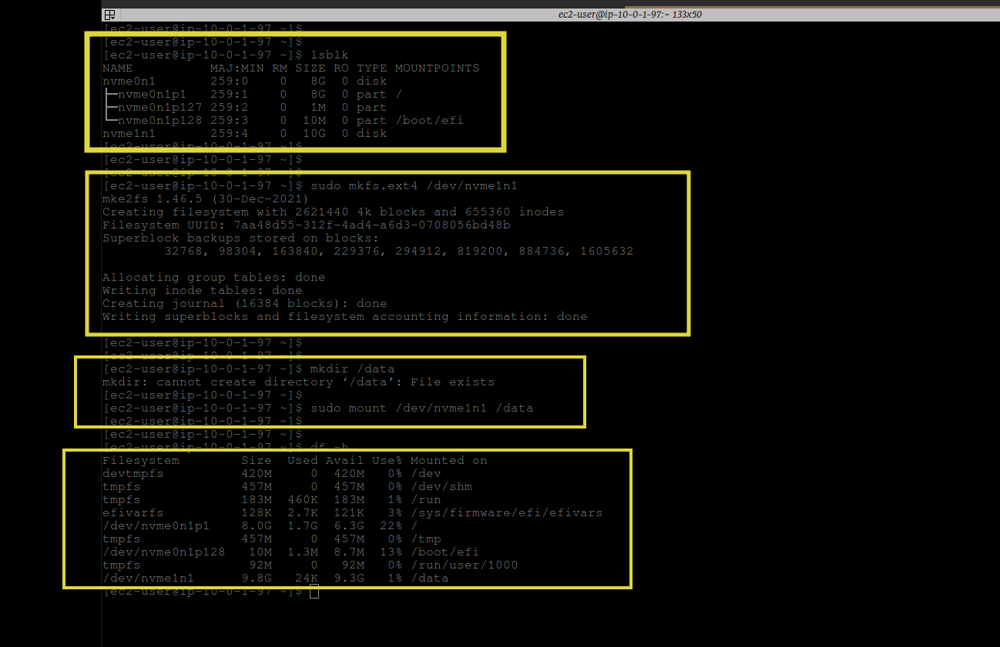

---

## Step 5 — Create an EBS Snapshot

Snapshots are point-in-time backups of EBS volumes stored in S3 (managed by AWS).

```
EC2 → Volumes → select your root volume → Actions → Create snapshot
  Description: lab-snapshot-before-changes
```

> **Forensics use:** When investigating a compromised instance, you take a snapshot of the EBS volume first — preserving evidence before touching anything. You then create a new volume from that snapshot and attach it to a clean forensic instance for analysis. Never analyze a live compromised instance directly.

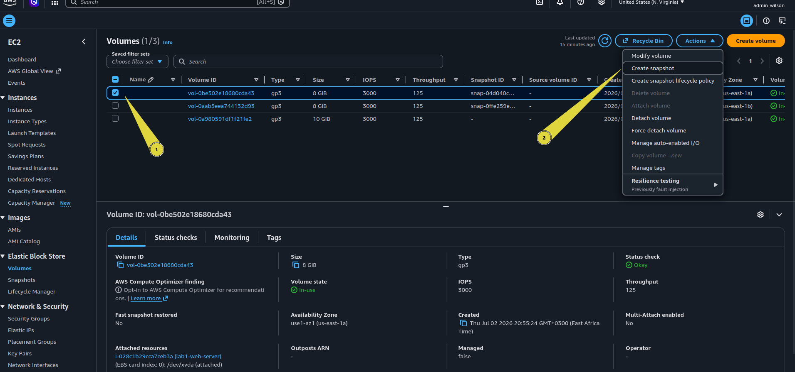

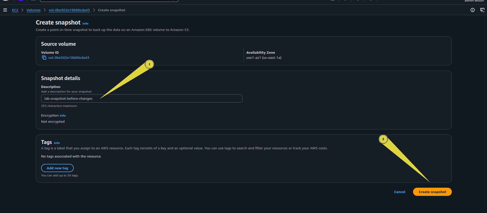

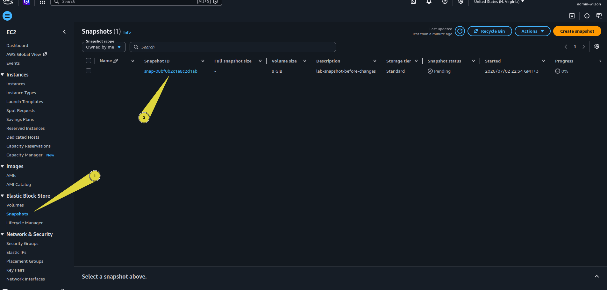

---

## Step 6 — Stop, Start, and Resize

### Stop the instance

```
EC2 → Instances → select instance → Instance state → Stop instance
```

When stopped: compute billing stops, EBS billing continues, public IP is released (unless using Elastic IP).

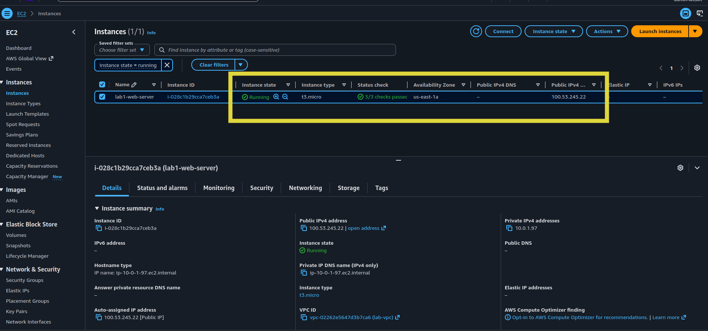

### Change the instance type

You can only change instance type when stopped:

```
Actions → Instance settings → Change instance type
→ select t2.small → Apply
```

### Start it again

```
Instance state → Start instance
```

Note the public IP has changed. This is why production servers use **Elastic IPs**.
13-take-ebs-snapshot-a.png

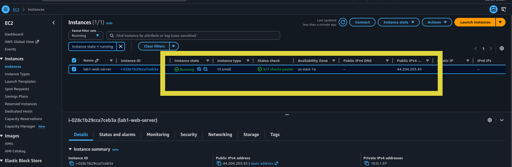

---

## Step 7 — Assign an Elastic IP

An Elastic IP is a static public IP that stays assigned to your account until you release it.

```
EC2 → Elastic IPs → Allocate Elastic IP address → Allocate
```

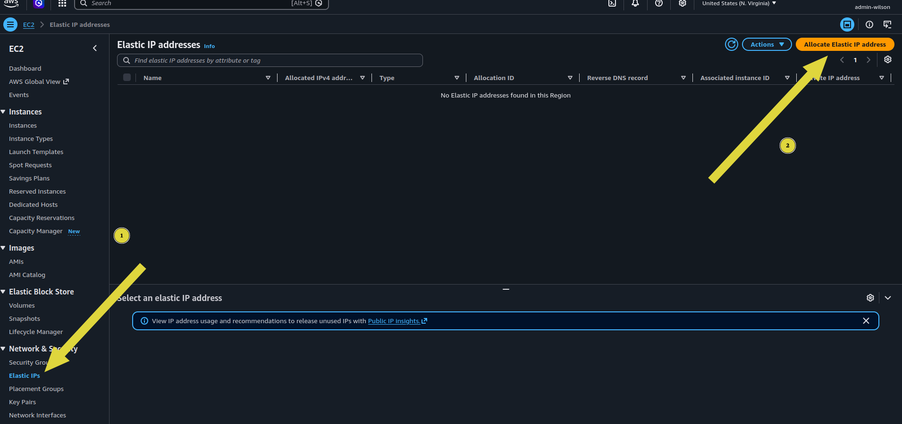


Then associate it:

```
Select the Elastic IP → Actions → Associate Elastic IP address
→ select lab-ec2-main → Associate
```
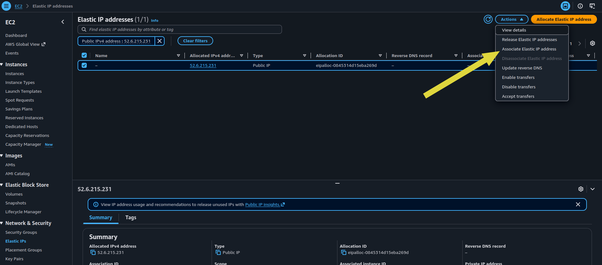

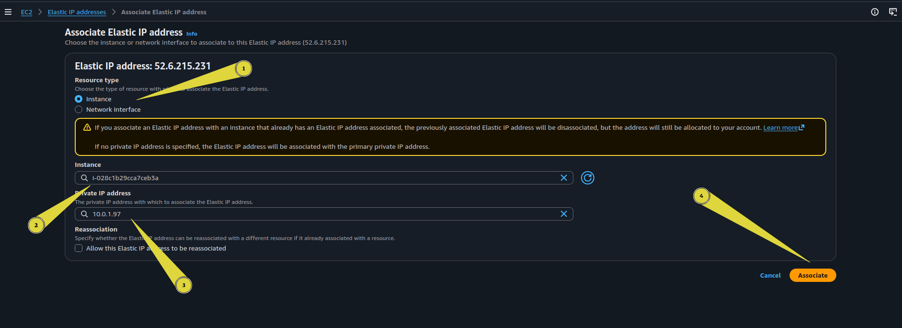

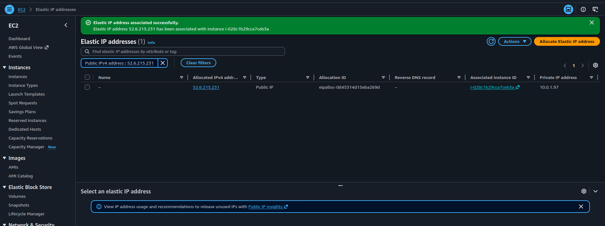

Your instance now has a permanent public IP that survives stop/start cycles.

> ⚠️ **Cost warning:** Elastic IPs are free only when associated with a running instance. If your instance is stopped or the IP is unassociated, AWS charges ~$0.005/hour. Always release Elastic IPs you are not using.

---

## Step 8 — Enable Detailed Monitoring

By default, EC2 sends metrics to CloudWatch every 5 minutes (basic monitoring, free). Detailed monitoring sends every 1 minute.

```
EC2 → Instances → select instance → Actions → Monitor and troubleshoot
→ Enable detailed monitoring
```

> Detailed monitoring costs ~$3.50/month per instance. For a lab, basic monitoring is sufficient. Enable detailed monitoring on production instances where fast anomaly detection matters.

---

## Step 9 — Get a System Log and Screenshot

Useful when an instance is unreachable:

```
EC2 → Instances → Actions → Monitor and troubleshoot → Get system log
EC2 → Instances → Actions → Monitor and troubleshoot → Get instance screenshot
```

The system log shows console output from boot — invaluable for diagnosing failed user data scripts or kernel panics.

---

## Step 10 — Termination Protection

Enable this on any instance you cannot afford to accidentally delete:

```
EC2 → Instances → Actions → Instance settings → Change termination protection → Enable
```

To terminate a protected instance you must first disable protection, then terminate. This forces a deliberate two-step action.

---

## Instance Lifecycle — Forensics Checklist

Before terminating any instance in an investigation:

```
[ ] Take EBS snapshot of all attached volumes
[ ] Download or export system logs
[ ] Capture instance screenshot
[ ] Record: instance ID, AMI ID, launch time, IAM role, security groups, VPC/subnet
[ ] Check CloudTrail for all API calls against this instance
[ ] Check VPC Flow Logs for network activity
[ ] If memory is needed: acquire before stopping (stopping loses RAM contents)
```

---

## Common EC2 CLI Commands

```bash
# List all running instances
aws ec2 describe-instances --filters "Name=instance-state-name,Values=running" --region us-east-1

# Start an instance
aws ec2 start-instances --instance-ids i-1234567890abcdef0

# Stop an instance
aws ec2 stop-instances --instance-ids i-1234567890abcdef0

# Create a snapshot
aws ec2 create-snapshot --volume-id vol-1234567890abcdef0 --description "forensic-copy"

# Get instance metadata from inside the instance
curl -s http://169.254.169.254/latest/meta-data/
```

---

## Troubleshooting Reference

| Problem | Cause | Fix |
|---------|-------|-----|
| Cannot SSH | Port 22 blocked | Check security group inbound rule |
| Web server not loading | Port 80 blocked | Check security group HTTP rule |
| Instance won't start | Insufficient capacity | Try a different AZ |
| User data script didn't run | Syntax error in script | Check `/var/log/cloud-init-output.log` |
| High CPU immediately after launch | `yum update` running | Wait a few minutes |
| Lost public IP after restart | No Elastic IP assigned | Assign an Elastic IP |

---

## Cleanup

```
1. Disassociate and release any Elastic IPs
2. EC2 → Instances → Terminate lab-ec2-main
3. EC2 → Volumes → delete any unattached volumes
4. EC2 → Snapshots → delete lab-snapshot-before-changes
```

---

## Phase 1 Progress Tracker

- [x] VPC from scratch
- [x] IAM users, groups, roles, policies
- [x] EC2 instance lifecycle
- [ ] S3 buckets and policies
- [ ] Security groups and NACLs
- [ ] CloudTrail setup
- [ ] CloudWatch alarms
- [ ] Billing and cost controls

---

*Phase 1 · AWS Cybersecurity & Digital Forensics Roadmap*
