# 🔥 Security Groups & NACLs: Network Access Control

> **Phase 1 · Document 5 of 29**  
> **Estimated cost:** Free · **Estimated time:** 45–60 minutes  
> **Prerequisites:** `01-vpc-from-scratch.md`, `02-iam-users-groups-roles.md`

---

## Two Layers of Network Defense

AWS gives you two independent firewall layers inside a VPC:

```
Internet
    │
    ▼
[ NACL ] ← subnet-level firewall (stateless)
    │
    ▼
[ Security Group ] ← instance-level firewall (stateful)
    │
    ▼
[ EC2 Instance ]
```

> **Security principle  - defense in depth:** Two independent layers mean an attacker must bypass both. A misconfigured security group does not automatically expose an instance if the NACL is also blocking traffic.

---

## Security Groups vs NACLs : Key Differences

| Feature | Security Group | NACL |
|---------|---------------|------|
| Applied to | EC2 instance (ENI) | Subnet |
| Stateful? | Yes: return traffic automatic | No: must explicitly allow both directions |
| Rules | Allow only | Allow and Deny |
| Rule evaluation | All rules evaluated | Rules evaluated in number order, first match wins |
| Default | Deny all inbound, allow all outbound | Allow all inbound and outbound |
| Use case | Per-instance access control | Subnet-wide blocking |

---

## Part 1: Security Groups

### Step 1: Understand the Default Security Group

Every VPC has a default security group. Look at it:

```
EC2 → Security Groups → find the one named "default" in lab1-vpc
```

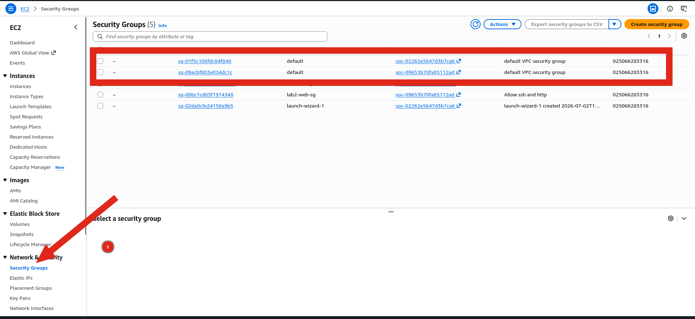


Inbound rules: allows all traffic **from other instances in the same security group**.  

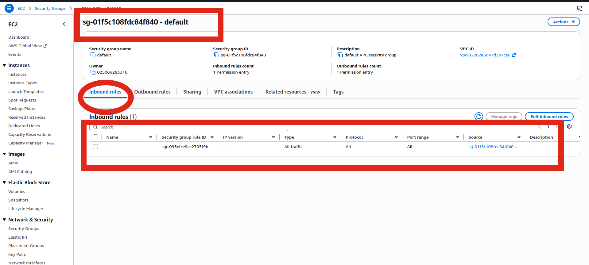

Outbound rules: allows all traffic to anywhere.

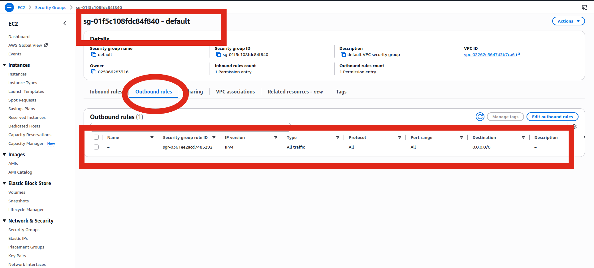


> **Never use the default security group for your instances.** Always create purpose-built security groups with minimal rules. The default SG is a common misconfiguration that allows lateral movement between instances.

---

### Step 2: Create Purpose-Built Security Groups

**Console path:** `EC2 → Security Groups → Create security group`

#### Web server SG

| Field | Value |
|-------|-------|
| Name | `lab1-web-server-sg` |
| Description | `Public web server: HTTP and HTTPS only` |
| VPC | `lab1-vpc` |

Inbound rules:

| Type | Port | Source | Reason |
|------|------|--------|--------|
| HTTP | 80 | `0.0.0.0/0` | Public web traffic |
| HTTPS | 443 | `0.0.0.0/0` | Encrypted web traffic |
| SSH | 22 | Your IP `/32` | Admin access only |

Outbound rules: leave default (all traffic).

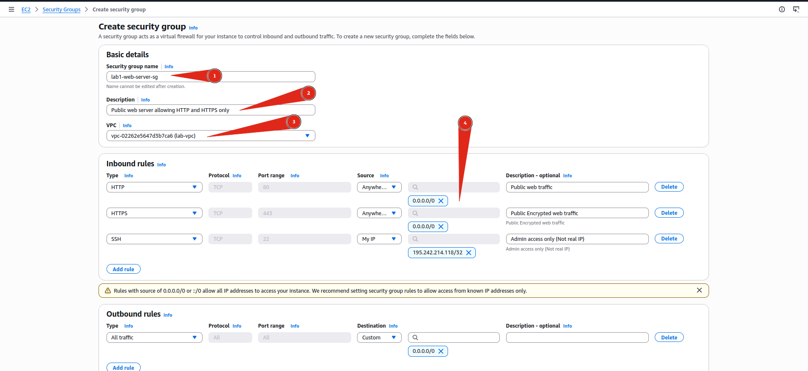


#### App server SG

| Field | Value |
|-------|-------|
| Name | `lab1-app-server-sg` |
| Description | `App tier only accessible from web tier` |
| VPC | `lab1-vpc` |

Inbound rules:

| Type | Port | Source | Reason |
|------|------|--------|--------|
| Custom TCP | 8080 | `lab1-web-server-sg` | Only web servers can reach app servers |

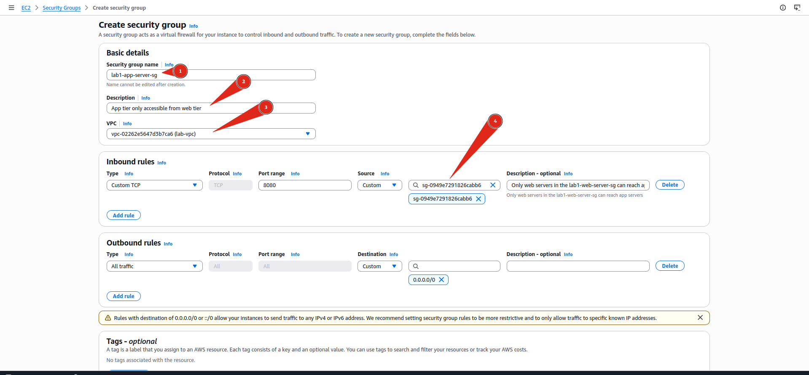

> **This is referencing a security group as a source**: not an IP range. Any instance with `lab1-web-server-sg` attached can reach this instance on port 8080. This is more secure than IP-based rules because it adapts automatically as instances are added or removed.

#### Database SG

| Field | Value |
|-------|-------|
| Name | `lab1-database-sg` |
| Description | `Database tier only accessible from app tier` |
| VPC | `lab1-vpc` |

Inbound rules:

| Type | Port | Source | Reason |
|------|------|--------|--------|
| MySQL/Aurora | 3306 | `lab1-app-server-sg` | Only app servers can reach the DB |

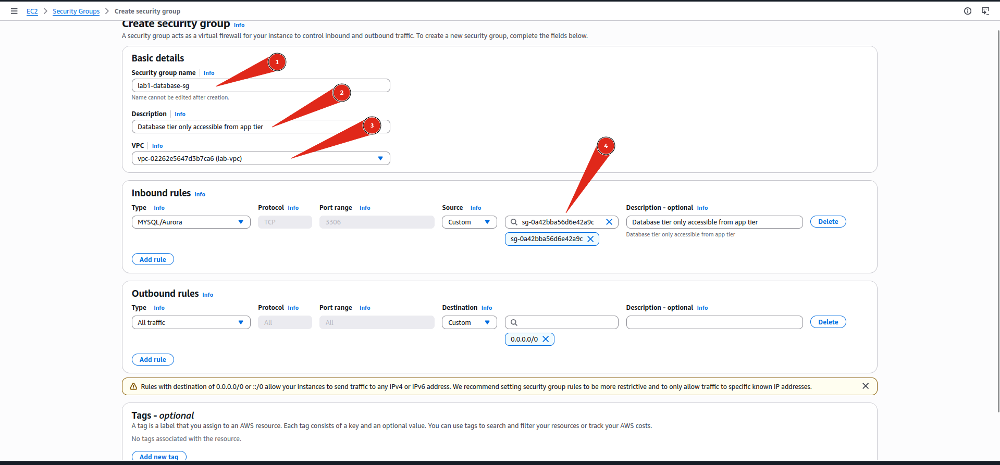

> This creates a tiered security architecture: Internet → Web (port 80/443) → App (port 8080) → Database (port 3306). Each layer can only talk to the layer directly adjacent to it.

---

### Step 3: Security Group Chaining Diagram

The Network setup (VPC and routings)
```
                 Internet
                     │
            Internet Gateway
                     │
        ┌──────────────────────────────┐
        │ Public Subnet                │
        │                              │
        │ EC2 Web Server               │
        │ Security Group:              │
        │ lab1-web-server-sg           │
        └──────────────┬───────────────┘
                       │
                  Private IP
                       │
        ┌──────────────────────────────┐
        │ Private Subnet               │
        │                              │
        │ EC2 App Server               │
        │ Security Group:              │
        │ lab1-app-server-sg           │
        └──────────────┬───────────────┘
                       │
                  Private IP
                       │
        ┌──────────────────────────────┐
        │ Private Subnet               │
        │                              │
        │ EC2 Database                 │
        │ Security Group:              │
        │ lab1-database-sg             │
        └──────────────────────────────┘
```


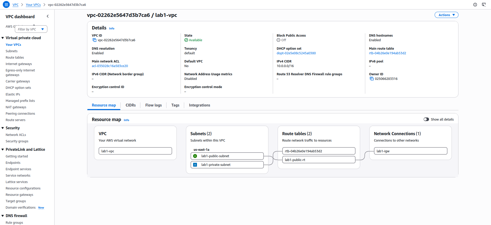


> This architecture means even if the web server is compromised, the attacker cannot directly reach the database they must first pivot through the app server.
> 
> **Important:** Security Groups are attached to **EC2 instances (their Elastic Network Interfaces)**, **not** to subnets. The subnets themselves are protected by **Network ACLs (NACLs)**.
>

---

### Step 4: Security Group Rules for Forensics Tools

For a forensic analysis instance:

| Type | Port | Source | Reason |
|------|------|--------|--------|
| SSH | 22 | Your IP | Remote access for analyst |
| Custom TCP | 9200 | `lab1-app-server-sg` | Elasticsearch access (log analysis) |
| RDP | 3389 | Your IP | Windows forensic tools |

---

### Step 5: Test Security Group Rules

Launch two instances:
 
- **Web Server** (`lab1-web-server`) in `lab1-public-subnet` using `lab1-web-server-sg`

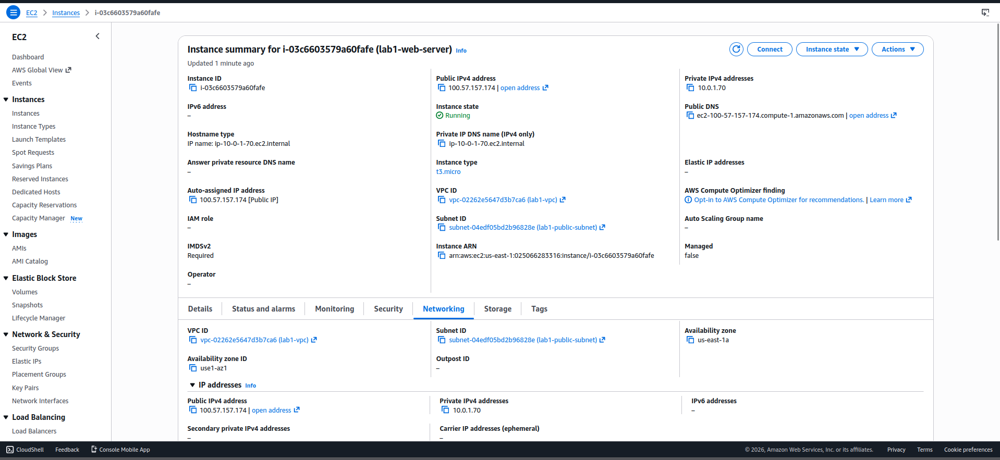

- **App Server** (`lab1-app-server`) in `lab1-private-subnet` using `lab1-app-server-sg`.


> Ensure the app server is in the private subnet, no public IP assigned and that it can connect with the ssm session manager

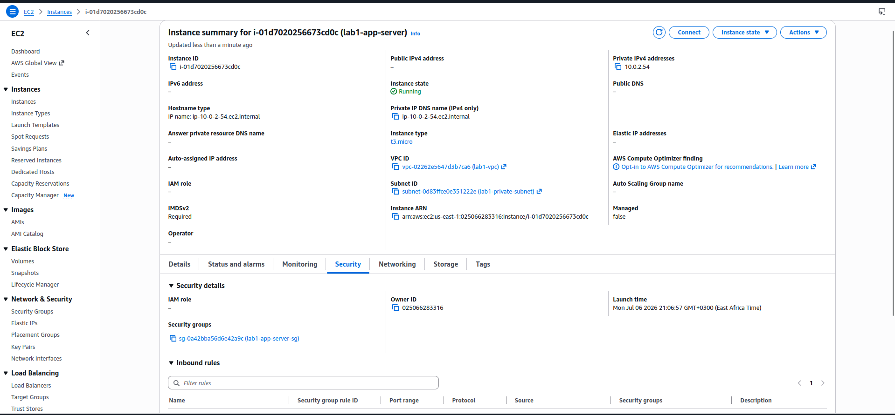


**App Server Connectivity: Private Subnet, No NAT**

Since the app server has no public IP and no NAT Gateway, standard SSH access
is impossible, there's no route in. Use **SSM Session Manager** instead,
which needs its own connectivity fix first.

**Why the SSM Agent needs help**

With no public IP and no NAT Gateway, the app server has no path to the
internet at all, and SSM's control plane (`ssm`, `ssmmessages`,
`ec2messages`) lives outside your VPC by default. 

Without a route, the agent shows as **offline**, not a security group or NACL problem, just no path out.

**Fix: Three VPC Interface Endpoints**

Create these in the private subnet before testing SSM:

| Endpoint | Service name |
|---|---|
| SSM | `com.amazonaws.<region>.ssm` |
| SSM Messages | `com.amazonaws.<region>.ssmmessages` |
| EC2 Messages | `com.amazonaws.<region>.ec2messages` |

For each: 
```
**VPC → Endpoints → Create endpoint**
```
**Type:** AWS services
**Search** the service name
**VPC:** `lab1-vpc`
**Subnet:** the private subnet
**Enable Private DNS name** (critical; without it, the agent still tries the public hostname)
**Security group:** A dedicated `lab1-vpc-endpoints-sg` 
**Allowing inbound 443 from `lab1-app-server-sg`:** Not the app server's own SG attached directly. It has no rule permitting itself in on 443).

This keeps the subnet genuinely private: no `0.0.0.0/0` route, no NAT
Gateway cost, and SSM traffic never touches the public internet.

**Launch the app server accordingly**

- Subnet: private subnet, auto-assign public IP **disabled**
- IAM role: attach `AmazonSSMManagedInstanceCore` at launch
- Security group: `lab1-app-server-sg` (as defined in Step 2) — no inbound
  SSH rule needed at all, since SSM replaces it
- User data: wrap the test listener in systemd so it survives reboot:

```bash
#!/bin/bash
cat << 'EOF' > /etc/systemd/system/app-server.service
[Unit]
Description=Simple test HTTP listener on 8080
After=network.target

[Service]
ExecStart=/usr/bin/python3 -m http.server 8080
Restart=always
User=ec2-user
WorkingDirectory=/home/ec2-user

[Install]
WantedBy=multi-user.target
EOF
systemctl daemon-reload
systemctl enable app-server
systemctl start app-server
```

A raw `python3 -m http.server 8080` in user data would die the moment the
instance reboots, user data only runs once, at first boot. systemd makes
the listener durable.

**Connect and verify**

```bash
aws ssm start-session --target <app-server-instance-id>
sudo systemctl status app-server
sudo ss -tulnp | grep 8080   # confirm 0.0.0.0:8080, not 127.0.0.1:8080
```

If the instance shows offline: confirm all three endpoints exist with the
correct security group, then `sudo systemctl restart amazon-ssm-agent` if
the IAM role was attached after launch rather than at launch.


#### From the Web Server, test connectivity to the App Server using its private IP:

```bash
# Should succeed (allowed by Security Group reference)
curl http://<app-server-private-ip>:8080

# Should fail (no rule allows port 3306)
nc -zv <app-server-private-ip> 3306
```

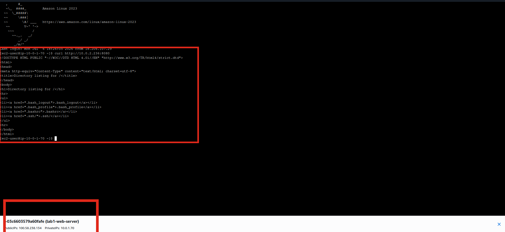

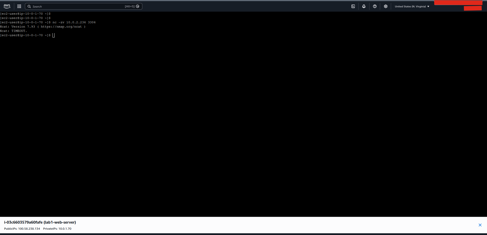


> **Important:** Always test both Allow and Deny cases. A security control you haven't tested blocking is one you can't trust.

---

## Part 2: Network ACLs (NACLs)

NACLs operate at the subnet level. They evaluate rules in order: lowest number first: and stop at the first match.

### Step 6: Examine the Default NACL

```
VPC → Network ACLs → find the one associated with lab1-vpc
```

Default rules:
- Inbound rule 100: Allow all traffic from anywhere
- Inbound rule *: Deny all (catch-all)
- Outbound rule 100: Allow all traffic to anywhere
- Outbound rule *: Deny all (catch-all)

The default NACL allows everything: it does not restrict traffic at all.

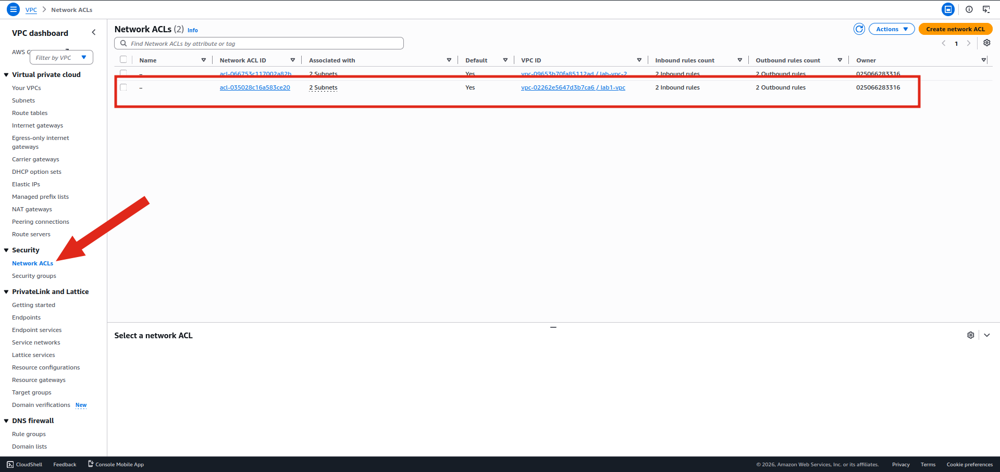

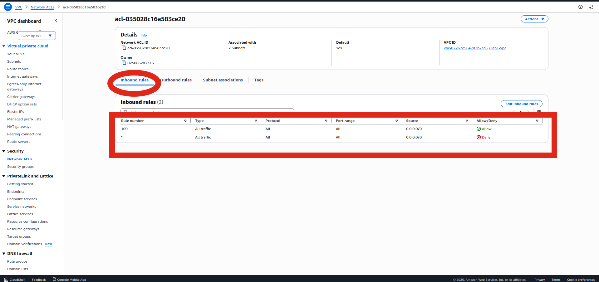

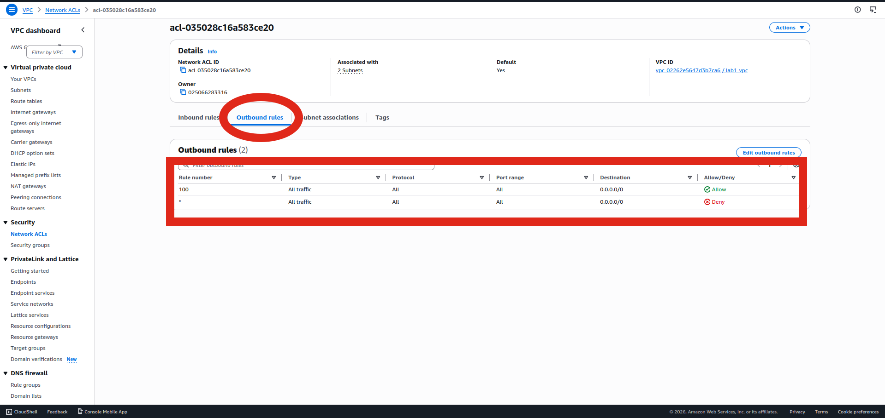

---

### Step 7: Create a Custom NACL

**Console path:** `VPC → Network ACLs → Create network ACL`

| Field | Value |
|-------|-------|
| Name | `lab1-nacl-public` |
| VPC | `lab1-vpc` |

A new NACL starts with **Deny all** on both inbound and outbound. You must explicitly add Allow rules.

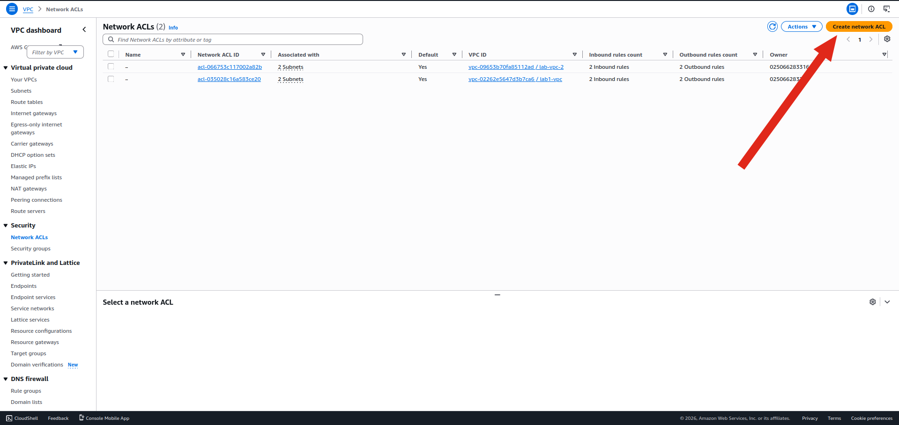

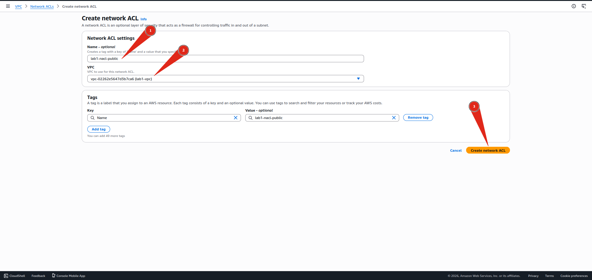


#### Inbound rules

| Rule # | Type | Port | Source | Allow/Deny |
|--------|------|------|--------|-----------|
| 100 | HTTP | 80 | `0.0.0.0/0` | Allow |
| 110 | HTTPS | 443 | `0.0.0.0/0` | Allow |
| 120 | SSH | 22 | Your IP `/32` | Allow |
| 130 | Custom TCP | 1024–65535 | `0.0.0.0/0` | Allow |
| * | All traffic | All | `0.0.0.0/0` | Deny |

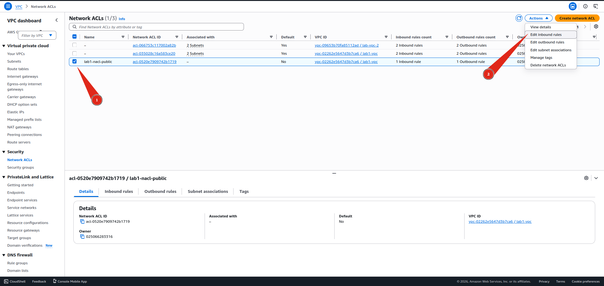

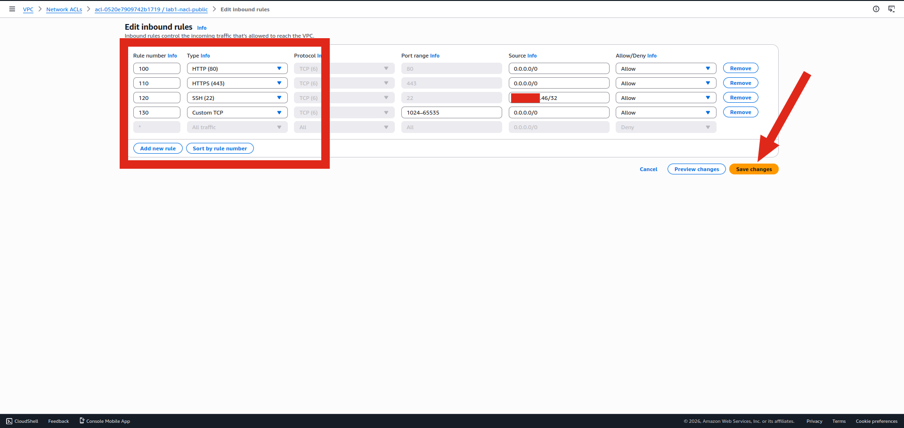

> **Why rule 130?** NACLs are stateless. When your instance responds to an HTTP request, the response goes back on an ephemeral port (1024–65535). You must explicitly allow this return traffic inbound: unlike security groups which handle this automatically.

#### Outbound rules

| Rule # | Type | Port | Destination | Allow/Deny |
|--------|------|------|-------------|-----------|
| 100 | HTTP | 80 | `0.0.0.0/0` | Allow |
| 110 | HTTPS | 443 | `0.0.0.0/0` | Allow |
| 120 | Custom TCP | 1024–65535 | `0.0.0.0/0` | Allow |
| * | All traffic | All | `0.0.0.0/0` | Deny |

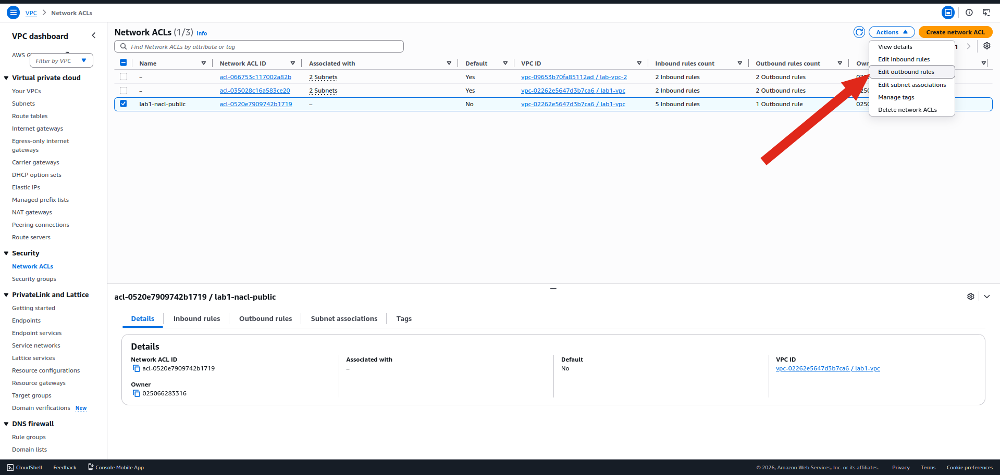

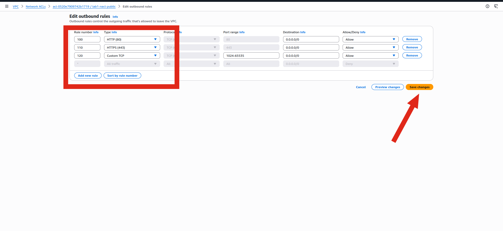


Associate with subnet:

```
Subnet associations → Edit subnet associations → select lab1-public-subnet
```
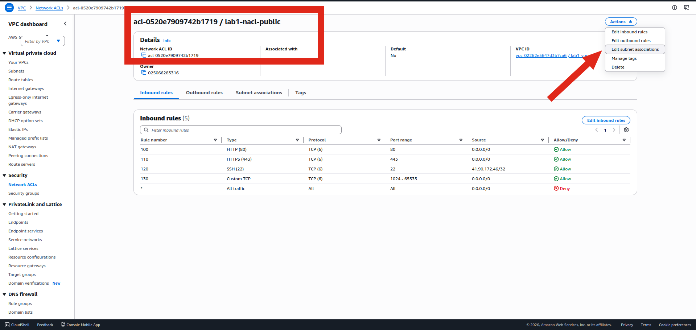

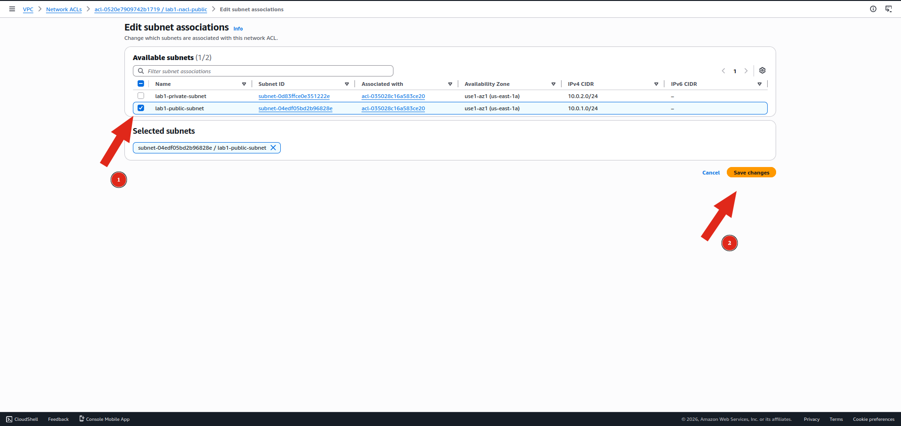

---

### Step 8: Use NACLs to Block a Specific IP

This is a common incident response action: block an attacker's IP at the network level:

```
VPC → Network ACLs → lab1-nacl-public → Inbound rules → Edit
Add rule:
  Rule #:    90   (lower number = evaluated first)
  Type:      All traffic
  Source:    <attacker-ip>/32
  Action:    Deny
```
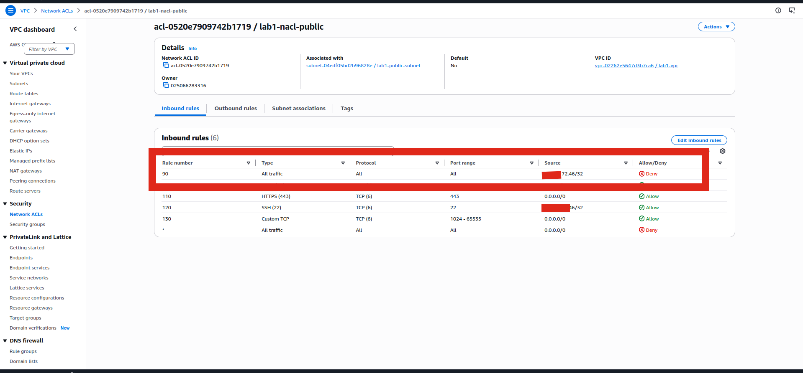

> Rule 90 is evaluated before rule 100 (HTTP Allow). The attacker's traffic is denied before it can reach your instance, even if the security group would otherwise allow it.

---

## Security Groups vs NACLs: When to Use Each

| Scenario | Use |
|----------|-----|
| Controlling which instances can talk to each other | Security group |
| Blocking a specific IP address | NACL (Deny rules) |
| Allowing traffic between tiers (web → app) | Security group (SG reference as source) |
| Subnet-wide lockdown during an incident | NACL |
| Port-based access between services | Security group |
| Compliance requirement for network-level logging | VPC Flow Logs + NACLs |

---

## Forensics Investigation Checklist

When investigating a potentially compromised instance, check both layers:

```
Security Groups:
  [ ] Are there any 0.0.0.0/0 rules on sensitive ports (22, 3389, 3306)?
  [ ] Were any rules recently modified? (check CloudTrail for AuthorizeSecurityGroupIngress)
  [ ] Are there unexpected security groups attached to the instance?

NACLs:
  [ ] Is the default NACL (allow-all) still in use?
  [ ] Are there any recently added rules?
  [ ] Check CloudTrail for CreateNetworkAclEntry events
```

---

## Common CLI Commands

```bash
# List security groups in your VPC
aws ec2 describe-security-groups --filters "Name=vpc-id,Values=vpc-xxxxxxxx"

# Add an inbound rule to a security group
aws ec2 authorize-security-group-ingress \
  --group-id sg-xxxxxxxx \
  --protocol tcp \
  --port 80 \
  --cidr 0.0.0.0/0

# Block an IP via NACL
aws ec2 create-network-acl-entry \
  --network-acl-id acl-xxxxxxxx \
  --rule-number 90 \
  --protocol -1 \
  --rule-action deny \
  --ingress \
  --cidr-block 1.2.3.4/32

# List all NACLs
aws ec2 describe-network-acls --filters "Name=vpc-id,Values=vpc-xxxxxxxx"
```

---

## Cleanup

```
1. Delete custom security groups (lab1-web-server-sg, lab1-app-server-sg, sg-database)
   Note: cannot delete a SG that is still attached to an instance
2. Delete lab1-nacl-public
   Note: must disassociate from subnets first
```

---

## Phase 1 Progress Tracker

- [x] VPC from scratch
- [x] IAM users, groups, roles, policies
- [x] EC2 instance lifecycle
- [x] S3 buckets and policies
- [x] Security groups and NACLs
- [ ] CloudTrail setup
- [ ] CloudWatch alarms
- [ ] Billing and cost controls

---

*Phase 1 · AWS Cybersecurity & Digital Forensics Roadmap*
