# 🔍 CloudTrail: Audit Logging & Forensic Evidence

> **Phase 1 · Document 6 of 29**
> **Estimated cost:** ~$2/month for S3 storage · **Estimated time:** 45–60 minutes
> **Prerequisites:** `04-s3-buckets-and-policies.md`

---

## What Is CloudTrail?

CloudTrail records every API call made in your AWS account: every console click, every CLI command, every SDK call. It answers the forensic questions:

```
Who did what?
When did they do it?
From which IP address?
Did it succeed or fail?
What exactly changed?
```

> **This is your most important forensic tool in AWS.** Before doing anything else in a cloud investigation, pull the CloudTrail logs. Every action leaves a trace here.

---

## What CloudTrail Captures

| Event type | Examples |
|-----------|---------|
| **Management events** | Creating/deleting resources, IAM changes, VPC modifications |
| **Data events** | S3 object reads/writes, Lambda function executions |
| **Insights events** | Anomalous API activity (unusual call volumes) |

> By default, only management events are logged. Data events must be explicitly enabled: but they are critical for forensics (knowing exactly which S3 objects were accessed).

---

## Step 1: Create a Trail

**Console path:** `CloudTrail → Trails → Create trail`

| Field | Value |
|-------|-------|
| Trail name | `lab1-audit-trail` |
| Storage location | Create new S3 bucket → `lab1-cloudtrail-logs-willy` |
| Log file SSE-KMS encryption | Disable (for the lab: enable in production) |
| Log file validation | **Enable** (detects if logs are tampered with) |
| CloudWatch Logs | **Enable** → create new log group `/cloudtrail/lab1` |
| Create new IAM Role | `Lab1CloudTrailRoleForCloudwatchLogs` |
| SNS notification | Skip for now |

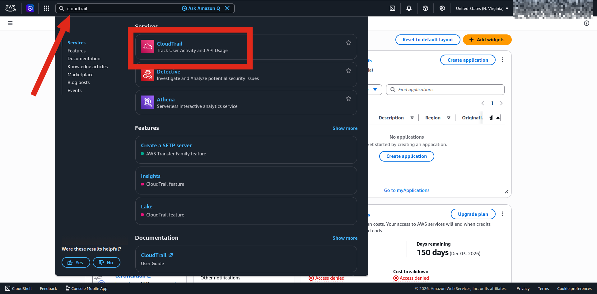

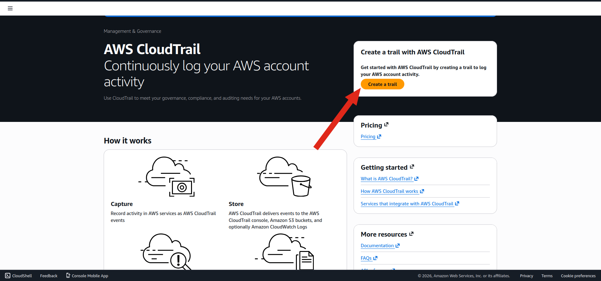

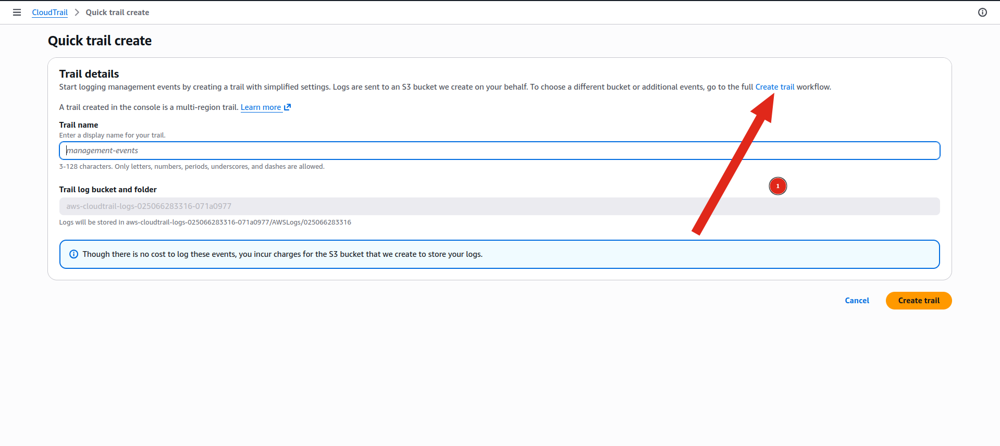

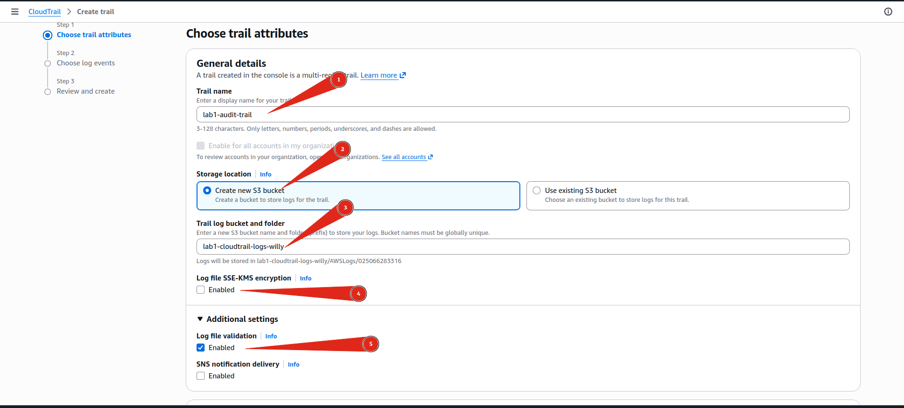

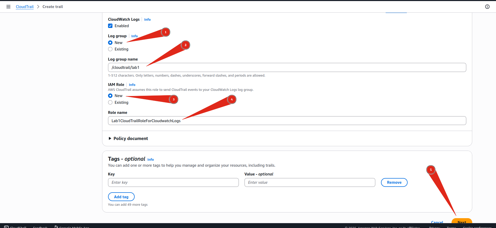

### Event types to log

| Event type | Enable? | Reason |
|-----------|---------|--------|
| Management events | Yes: Read/Write | All API calls |
| Data events: S3 | Yes: All | S3 object-level activity |
| Data events: Lambda | Yes | Function invocations |
| Insights events | Yes | Anomaly detection |

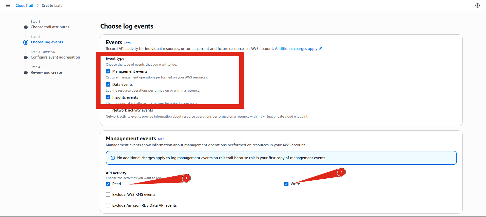

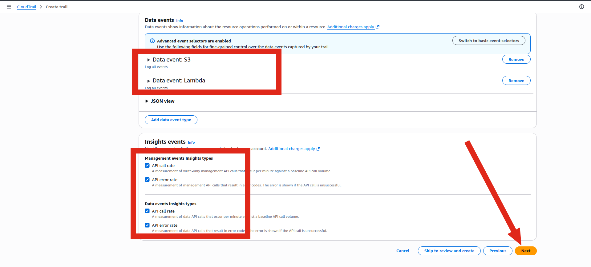

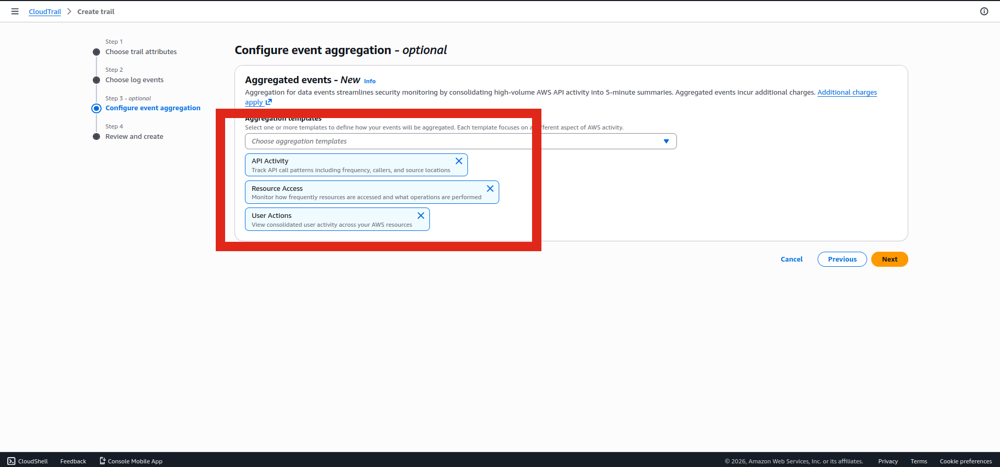

> **Multi-region:** Ensure `Apply trail to all regions` is enabled. An attacker operating in a region you don't watch leaves no trace in a single-region trail.

Click **Create trail**.

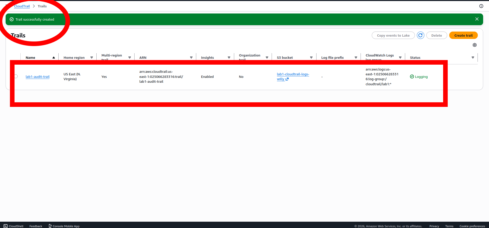

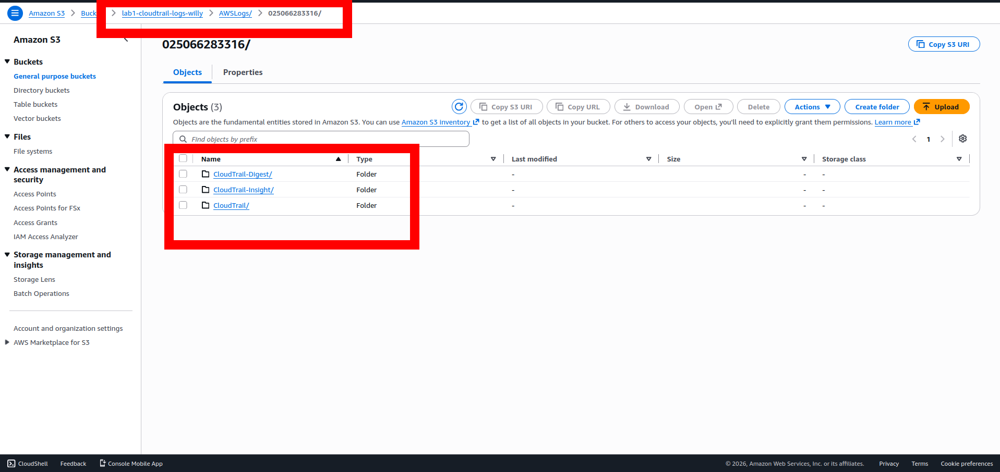

---

## Step 2: Understand a CloudTrail Log Entry

Navigate to your S3 bucket and download a log file. Logs are gzipped JSON:

```bash
# Download and read a log file
aws s3 cp s3://lab1-cloudtrail-logs-willy/AWSLogs/ACCOUNT-ID/CloudTrail/us-east-2/YYYY/MM/DD/logfile.json.gz .
gunzip logfile.json.gz
cat logfile.json | python3 -m json.tool
```

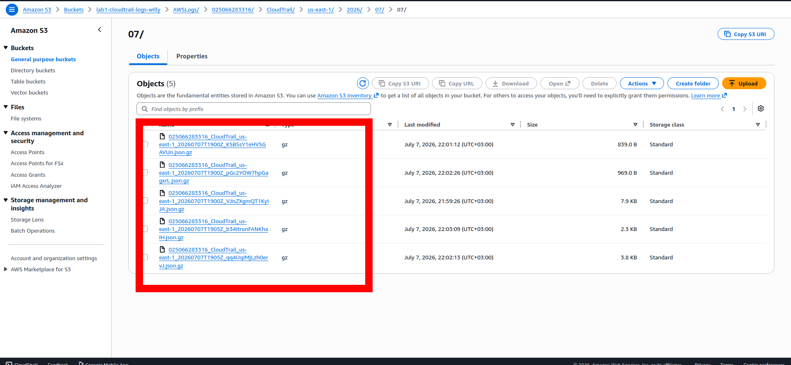

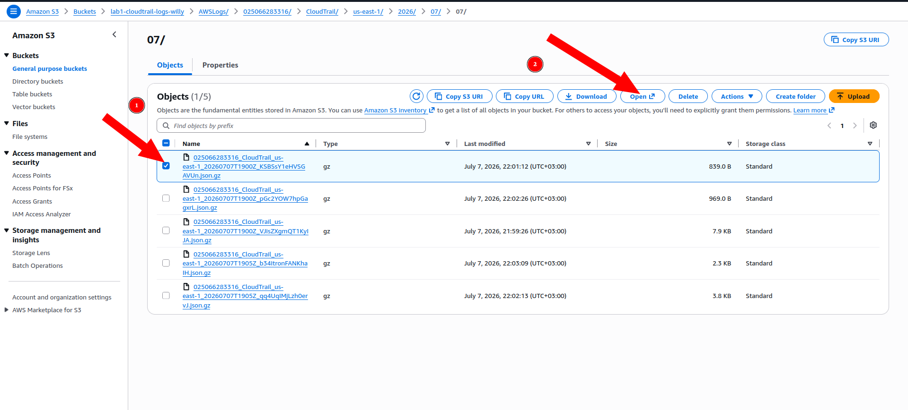

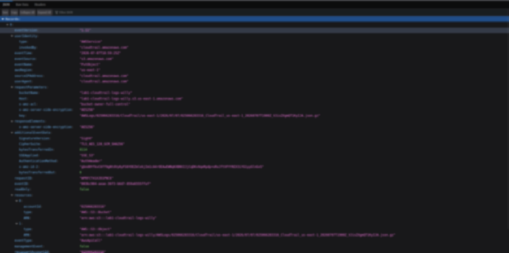

A single event looks like this:

```json
{
  "eventTime": "2024-01-15T09:23:41Z",
  "eventSource": "ec2.amazonaws.com",
  "eventName": "RunInstances",
  "awsRegion": "us-east-2",
  "sourceIPAddress": "41.80.12.34",
  "userAgent": "aws-cli/2.x",
  "userIdentity": {
    "type": "IAMUser",
    "userName": "dev-alice",
    "arn": "arn:aws:iam::123456789012:user/dev-alice"
  },
  "requestParameters": {
    "instanceType": "t2.micro",
    "imageId": "ami-xxxxxxxxxx"
  },
  "responseElements": {
    "instancesSet": {
      "items": [{ "instanceId": "i-1234567890abcdef0" }]
    }
  },
  "errorCode": null,
  "errorMessage": null
}
```

### Forensically significant fields

| Field | What it tells you |
|-------|------------------|
| `eventTime` | Exactly when the action occurred (UTC) |
| `eventName` | What was done (RunInstances, DeleteBucket, etc.) |
| `sourceIPAddress` | Where the request came from |
| `userIdentity` | Who made the request (IAM user, role, root) |
| `requestParameters` | What they asked for |
| `responseElements` | What AWS returned |
| `errorCode` | If it failed: why (useful for detecting failed attacks) |

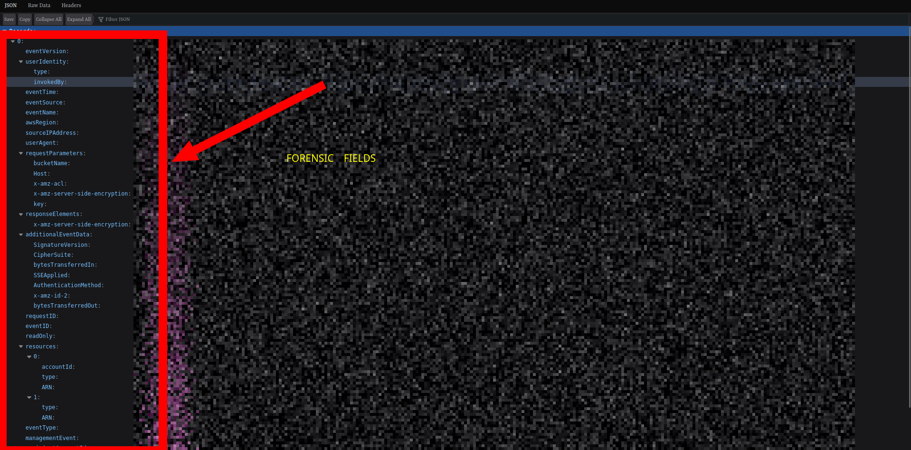

---

## Step 3: Query Logs with CloudWatch Logs Insights

CloudTrail logs flow into CloudWatch Logs in near real-time. You can query them like a database.

**Console path:** `CloudWatch → Logs Management`

Select log group: `/cloudtrail/lab1`

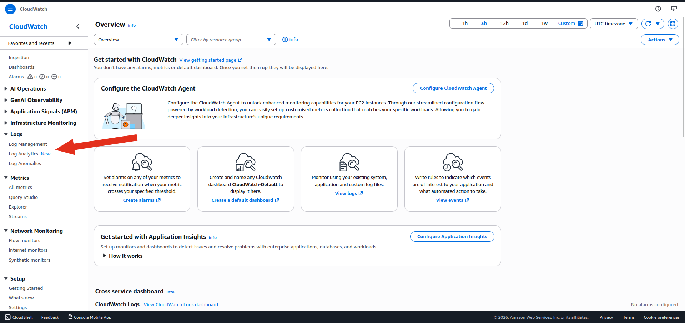

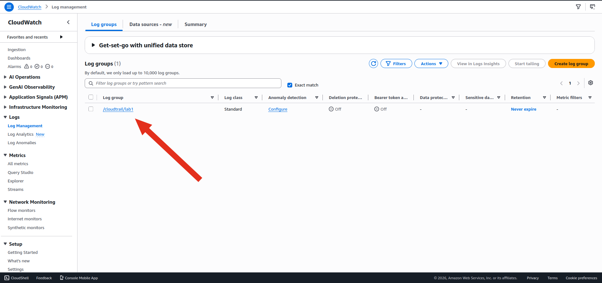

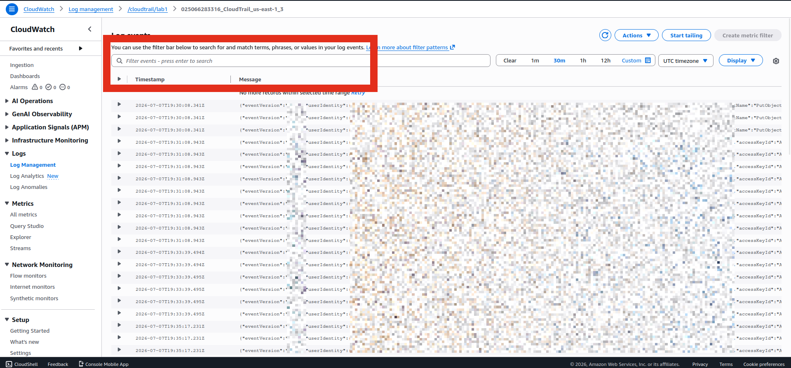

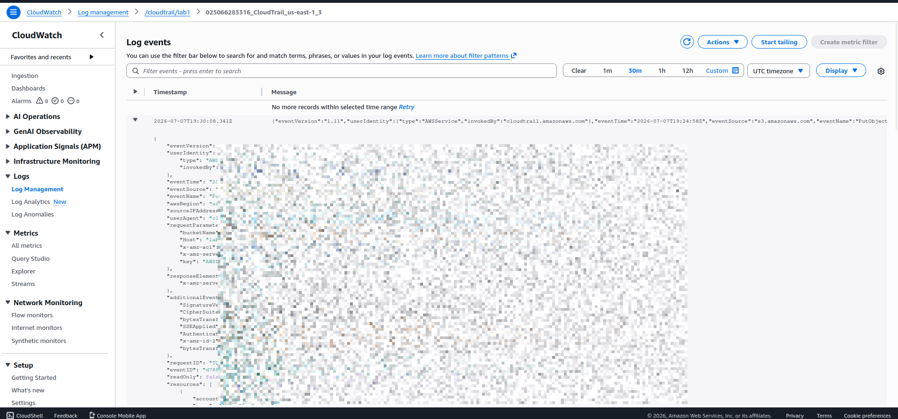

### Query 1: All actions by a specific user

```sql
fields eventTime eventName sourceIPAddress errorCode filter userIdentity.userName = "admin-wilson" sort eventTime desc limit 50
```

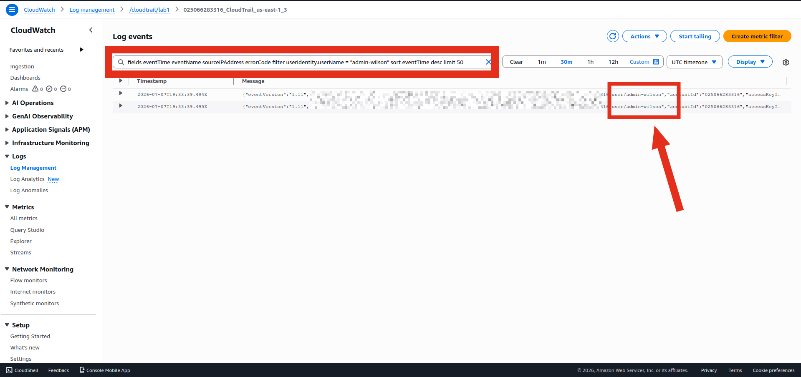

### Query 2: All failed API calls (detect probing)

```sql
fields eventTime eventName userIdentity.userName sourceIPAddress errorCode filter ispresent(errorCode) sort eventTime desc limit 100
```

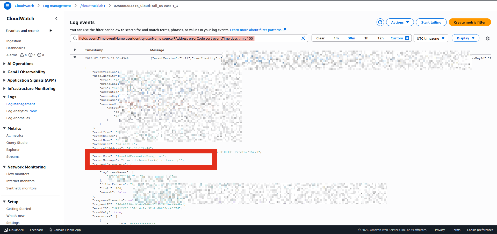

### Query 3: IAM changes (high priority alert)

```sql
fields eventTime eventName userIdentity.userName sourceIPAddress filter eventSource = "iam.amazonaws.com" sort eventTime desc
```

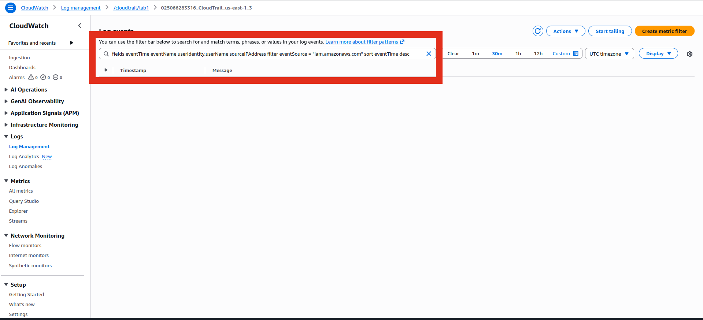

### Query 4: Root account activity (should be near zero)

```sql
fields eventTime eventName sourceIPAddress filter userIdentity.type = "Root" sort eventTime desc
```

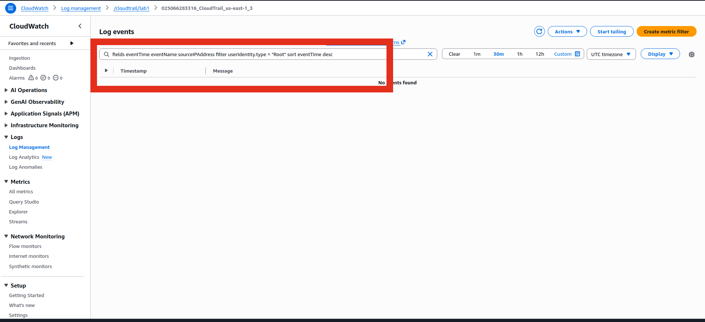

### Query 5: Security group modifications (detect firewall tampering)

```sql
fields eventTime, eventName, userIdentity.userName, sourceIPAddress
| filter eventName in ["AuthorizeSecurityGroupIngress",
                        "RevokeSecurityGroupIngress",
                        "CreateSecurityGroup",
                        "DeleteSecurityGroup"]
| sort eventTime desc
```

---

## Step 4: Create CloudWatch Alarms on CloudTrail Events

Set up automatic alerts for high-priority security events.

**Console path:** `CloudWatch → Log groups → /cloudtrail/lab1 → Metric filters → Create metric filter`

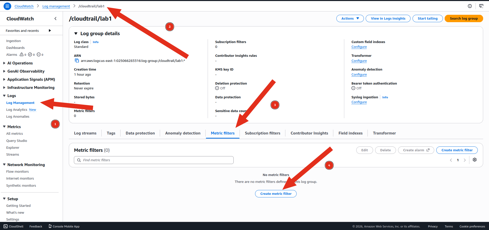

### Alert 1: Root account login

Filter pattern:
```
{ ($.userIdentity.type = "Root") && ($.eventName = "ConsoleLogin") }
```

| Field | Value |
|-------|-------|
| Metric namespace | `CloudTrailMetrics` |
| Metric name | `RootAccountLogin` |
| Metric value | `1` |

Then create an alarm on this metric: threshold ≥ 1 → send SNS email alert.

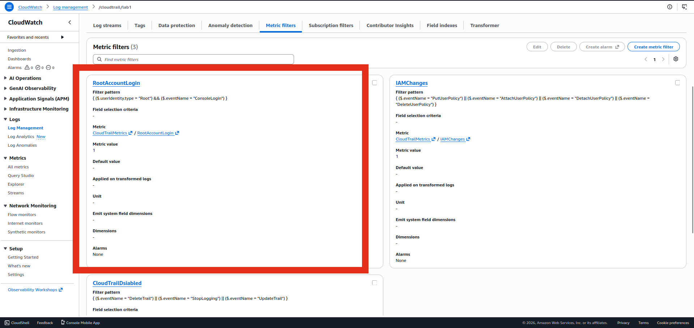

### Alert 2: IAM policy changes

```
{ ($.eventName = "PutUserPolicy") || ($.eventName = "AttachUserPolicy") ||
  ($.eventName = "DetachUserPolicy") || ($.eventName = "DeleteUserPolicy") }
```

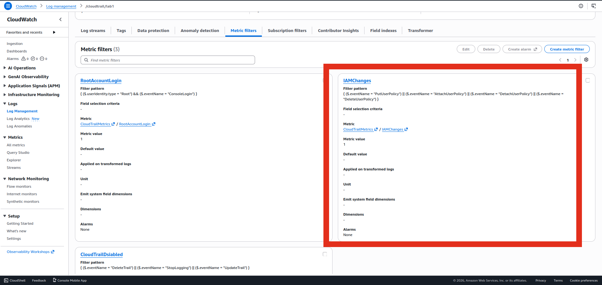

### Alert 3: CloudTrail itself being disabled

```
{ ($.eventName = "DeleteTrail") || ($.eventName = "StopLogging") ||
  ($.eventName = "UpdateTrail") }
```

> **This alert is critical.** The first thing many attackers do after gaining access is disable CloudTrail to cover their tracks. Alerting on this immediately tells you an attack is in progress.

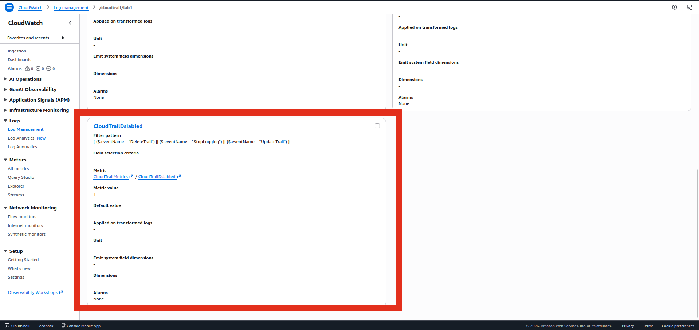

---

## Step 5: Enable Log File Validation

Log file validation creates a digest file every hour that cryptographically signs the log files. If logs are modified or deleted, validation fails.

This should already be enabled if you checked it during trail creation. Verify:

```
CloudTrail → Trails → lab1-audit-trail → Log file validation: Enabled
```

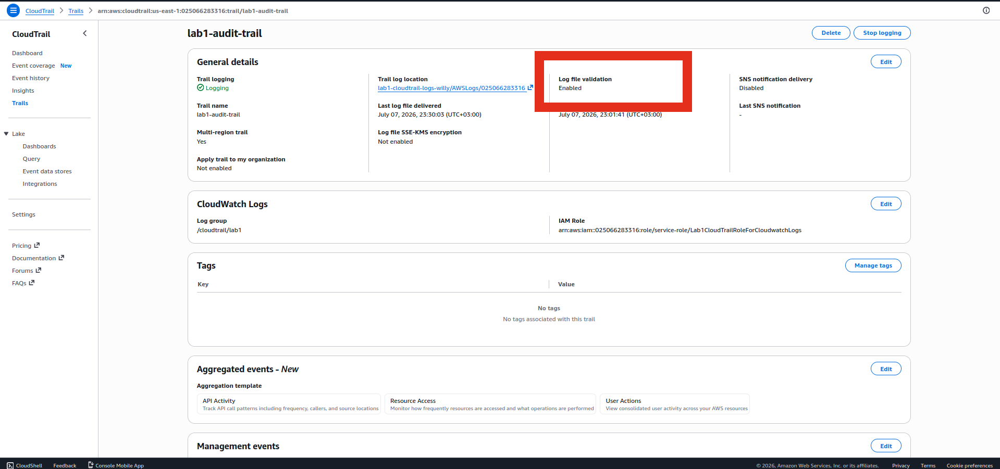

Validate logs from the CLI:

```bash
aws cloudtrail validate-logs \
  --trail-arn arn:aws:cloudtrail:us-east-2:ACCOUNT-ID:trail/lab1-audit-trail \
  --start-time 2024-01-01 \
  --end-time 2024-01-02
```

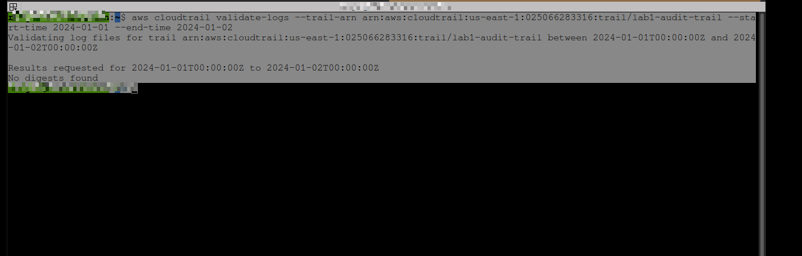

Output tells you if any log files were modified, deleted, or corrupted since creation: essential for maintaining the integrity of forensic evidence.

---

## Step 6: CloudTrail Lake (Advanced Querying)

CloudTrail Lake stores events in an immutable data store and lets you query them with SQL directly: no S3 downloads needed.

```
CloudTrail → Lake → Create event data store
  Name:          lab1-event-store
  Retention:     90 days
  Pricing:       Ingestion-based
```

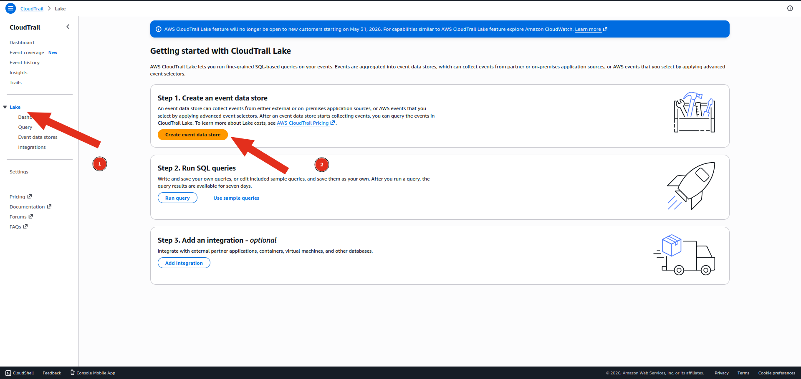

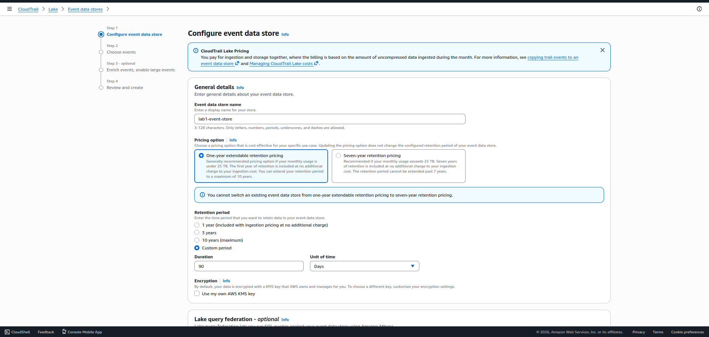

Run a query:

```sql
SELECT
  eventTime,
  eventName,
  userIdentity.userName,
  sourceIPAddress,
  errorCode
FROM
  lab-event-store
WHERE
  eventTime > '2024-01-01 00:00:00'
  AND errorCode IS NOT NULL
ORDER BY eventTime DESC
LIMIT 100
```

> CloudTrail Lake is how serious incident responders query cloud logs at scale. Think of it as a forensic database of everything that ever happened in your account.

---

## Forensics Scenario: Reconstruct an Attack Timeline

Simulate this scenario: someone used `dev-alice`'s credentials to make unauthorized changes.

Run these queries to reconstruct what happened:

```sql
-- Step 1: When did the unauthorized session start?
SELECT eventTime, sourceIPAddress, userAgent
FROM lab-event-store
WHERE userIdentity.userName = 'dev-alice'
ORDER BY eventTime ASC

-- Step 2: What did they do?
SELECT eventTime, eventName, requestParameters
FROM lab-event-store
WHERE userIdentity.userName = 'dev-alice'
ORDER BY eventTime ASC

-- Step 3: Did they create any new users or roles? (persistence)
SELECT eventTime, eventName, requestParameters
FROM lab-event-store
WHERE eventName IN ('CreateUser','CreateRole','AttachUserPolicy','AddUserToGroup')
ORDER BY eventTime ASC

-- Step 4: Did they access any S3 data? (exfiltration)
SELECT eventTime, eventName, resources
FROM lab-event-store
WHERE eventSource = 's3.amazonaws.com'
AND userIdentity.userName = 'dev-alice'
ORDER BY eventTime ASC
```

---

## CloudTrail Blind Spots (Know These)

| What CloudTrail does NOT log |
|-----------------------------|
| Data inside EC2 instances (OS logs, application logs) |
| Network packet contents (use VPC Flow Logs for network metadata) |
| Actions by the root account before CloudTrail was enabled |
| Activity in regions where the trail is not active |
| S3 data events unless explicitly enabled |

---

## Common CLI Commands

```bash
# Look up recent events for a specific resource
aws cloudtrail lookup-events \
  --lookup-attributes AttributeKey=ResourceName,AttributeValue=lab-web-server

# Look up events by username
aws cloudtrail lookup-events \
  --lookup-attributes AttributeKey=Username,AttributeValue=dev-alice

# Check if logging is active
aws cloudtrail get-trail-status --name lab1-audit-trail
```

---

## Cleanup

CloudTrail itself has no cost. The S3 storage does:

```
# Keep the trail running (it is your evidence source)
# To save money, reduce retention on the CloudWatch log group:
CloudWatch → Log groups → /cloudtrail/lab1 → Actions → Edit retention → 30 days
```

---

## Phase 1 Progress Tracker

- [x] VPC from scratch
- [x] IAM users, groups, roles, policies
- [x] EC2 instance lifecycle
- [x] S3 buckets and policies
- [x] Security groups and NACLs
- [x] CloudTrail setup
- [ ] CloudWatch alarms
- [ ] Billing and cost controls

---

*Phase 1 · AWS Cybersecurity & Digital Forensics Roadmap*